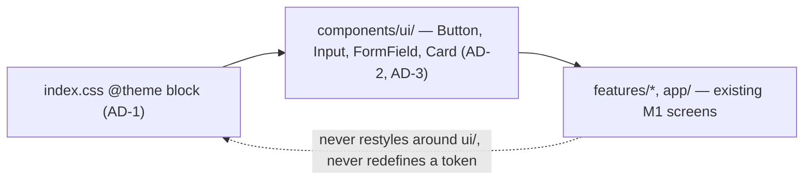

# Architecture Spine — Motor Insurance Portal — Milestone 2 Design System

## Design Paradigm

Tokenized utility-first styling: Tailwind CSS generates utility classes from a single `@theme` token block; a thin layer of native-element React components (`Button`, `Input`, `FormField`, `Card`) wraps those tokens into the only variant surface a screen composes against. Screens combine these primitives with plain Tailwind utility classes for layout only — they never re-derive a color, font, or component variant Tailwind/the component library already names.

```text
frontend/src/
  index.css              # @theme token block (single source of design tokens)
  components/ui/         # Button, Input, FormField, Card — the only variant surface
  features/, app/, i18n/, api/  # unchanged from Milestone 1 — consume components/ui/, never restyle around it
```

## Inherited Invariants

| Inherited | From parent | Binds here |
| --- | --- | --- |
| AD-8 — i18n is a frontend-only concern | architecture-motor-insurance-quote-claims-portal-2026-08-23 | Styling changes carry no copy changes; `react-i18next` catalogs are untouched by this milestone |
| AD-10 — Frontend routing, guarding, and data access | architecture-motor-insurance-quote-claims-portal-2026-08-23 | React Router v8, the one role-guard wrapper, and the one typed fetch client are unaffected — this milestone is presentation-only |

## Invariants & Rules

### AD-1 — Tailwind v4, CSS-first tokens [ADOPTED]

- **Binds:** `frontend`
- **Prevents:** hardcoded hex/pixel values scattered across screens, and a JS config file drifting from the CSS that actually ships
- **Rule:** Tailwind CSS v4 (`tailwindcss` + `@tailwindcss/vite`, verified current 2026-08-30, peer-compatible with the project's pinned Vite 8). No `tailwind.config.js`. Every design token from PRD §4 (navy `#2A2859` base, restrained accent, Inter font family, spacing/type scale) is defined exactly once, in an `@theme` block in `frontend/src/index.css`. Every custom token uses a semantic name (`--color-primary`, `--spacing-card-padding`) — never a bare re-derivation of Tailwind's own default scale (`--spacing-4`); the default scale already covers raw scale values, `@theme` only adds what it doesn't already name. No screen touched by this milestone contains a hardcoded hex color or inline `font-family` — every value resolves to a Tailwind utility class sourced from that block.

### AD-2 — Component variants via cva + clsx/tailwind-merge [ADOPTED]

- **Binds:** `frontend/src/components/ui/`
- **Prevents:** two components — or two variants added at different times — expressing "primary vs. secondary" (or any variant axis) through incompatible ad hoc `className` string logic
- **Rule:** `Button`, `Input`, `FormField`, `Card` live in `frontend/src/components/ui/`. Any variant surface (e.g. a button's `variant`/`size`) is defined with `class-variance-authority` (cva, verified current 0.7.1). A component accepting a caller-supplied `className` override resolves it through a `cn()` helper (`clsx`, latest 2.1.1 + `tailwind-merge`, verified current 3.6.0) so conflicting utility classes never silently collide — but that override may **only** carry spacing/sizing/positioning utilities (margin, width/height, position) for one-off placement. Color, background, border, and typography utilities are never passed via `className`; they belong exclusively inside the component's own variant definition, enforced by convention (AD-4), not tooling. A screen needing a new variant adds it to the component — it never fakes one by composing raw utility classes around an existing variant. `Card` exposes flat props (`title?`, `footer?`, `children`) — never a compound-component API (`Card.Header`/`Card.Body`) — keeping the four-component set's surface small and single-shaped.

### AD-3 — Components render native semantic elements [ADOPTED]

- **Binds:** `frontend/src/components/ui/`
- **Prevents:** an existing role-based test query (`screen.getByRole('button', ...)`, the pattern every M1 frontend test suite already uses) silently breaking because a component swapped a real element for a styled non-semantic stand-in
- **Rule:** `Button` renders a real `<button>`, `Input` a real `<input>`, `FormField` wraps a real `<label>` with its control — never a `<div>` carrying an ARIA role in place of the native element. This is what makes the PRD's own consequence ("existing tests still pass unmodified," FR-3/FR-4/FR-6) actually achievable, not just asserted.

### AD-4 — No automated enforcement of component-library adoption [ADOPTED]

- **Binds:** `frontend`, the team's code review process
- **Prevents:** over-engineering a two-person team's workflow with tooling it doesn't need
- **Rule:** nothing lints against a raw `<button>`/`<input>` outside `frontend/src/components/ui/`. Adoption is enforced by code review only, per the existing `CONTRIBUTING.md` process — an explicitly accepted risk, not a silent gap.

### AD-5 — `FormField` owns field-error display; `Input` only signals invalid state [ADOPTED]

- **Binds:** `frontend/src/components/ui/FormField.tsx`, `frontend/src/components/ui/Input.tsx`
- **Prevents:** two screens independently inventing incompatible error-state shapes — a boolean flag on `Input` vs. a message string on `FormField` — for the same concern
- **Rule:** `FormField` accepts `error?: string` (the already-translated message, per the `resolveFieldErrors` pattern Story 3.2b established) and renders it below the label/control. `Input` accepts a boolean `invalid` prop used only for visual styling (border/ring color via its cva variant) — it never renders error text itself. A screen passes the message to `FormField`, never to `Input` directly.

### AD-6 — Semantic status-color vocabulary fixed now, even without a `Badge` component [ADOPTED]

- **Binds:** any status-like visual treatment this milestone's role shells introduce, and any later milestone's Policy/Claims status displays
- **Prevents:** two independently-built status displays disagreeing on which color means "good" vs. "bad" (e.g. one shell's `success/warning/danger` vocabulary vs. another's raw `approved/pending/rejected` domain words mapped to different colors)
- **Rule:** the fixed status-color vocabulary is `success | warning | danger | info`. A screen showing a domain-specific status maps it to one of these four before choosing a color — it never invents a fifth category or reassigns which color means "bad." No `Badge` component exists this milestone (PRD explicitly scopes the base library to `Button`/`Input`/`FormField`/`Card`); this rule only fixes the vocabulary so a future `Badge` doesn't have to reconcile two shells' incompatible choices.



## Consistency Conventions

| Concern | Convention |
| --- | --- |
| Naming | Variant props are always named `variant` (and `size` where a component has one) — one vocabulary across all four components, not per-component invention. |
| Styling | Colors, fonts, and spacing are Tailwind utility classes resolving to the `@theme` tokens (AD-1) — never an inline `style` attribute, never a raw hex/px value in JSX. |
| State & cross-cutting | Every `components/ui/` primitive accepts a `className` prop merged via `cn()` (AD-2) for one-off layout positioning only — never to override the component's own variant styling. |

## Stack

| Name | Version |
| --- | --- |
| Tailwind CSS | v4.3.3 (verified 2026-08-30) |
| @tailwindcss/vite | current; peerDependency range `^5.2.0 \|\| ^6 \|\| ^7 \|\| ^8` covers the project's pinned Vite 8 (verified 2026-08-30) |
| class-variance-authority (cva) | 0.7.1 (verified 2026-08-30 — genuinely latest, package itself ~2 years dormant; watch for React 19 peer-dep churn) |
| clsx | 2.1.1 (verified 2026-08-30) |
| tailwind-merge | 3.6.0 (verified 2026-08-30 — 3.x line confirmed to support Tailwind v4.0–v4.3) |
| Inter (Google Fonts) | current — variable font |

## Structural Seed

```text
frontend/
  src/
    index.css               # @theme token block (AD-1) — navy/accent palette, Inter, spacing/type scale
    components/
      ui/                    # Button.tsx, Input.tsx, FormField.tsx, Card.tsx (AD-2, AD-3)
    app/                     # unchanged from Milestone 1 — RootLayout, RoleGuard, router
    features/                # unchanged from Milestone 1 — auth/, quote/, shells/ (visual pass only)
    i18n/                    # unchanged from Milestone 1
    api/                     # unchanged from Milestone 1
  vite.config.ts             # + @tailwindcss/vite plugin (AD-1)
```

## Capability → Architecture Map

| Capability / Area | Lives in | Governed by |
| --- | --- | --- |
| FR-1, FR-2 — Design tokens & base component library | `frontend/src/index.css`, `frontend/src/components/ui/` | AD-1, AD-2, AD-3 |
| FR-3 — Auth screens visual pass | `frontend/src/features/auth/` | AD-2, AD-3, AD-4 |
| FR-4, FR-5 — Quote flow visual pass | `frontend/src/features/quote/` | AD-2, AD-3, AD-4 |
| FR-6, FR-7 — Nav & role shells visual pass | `frontend/src/app/RootLayout.tsx`, `frontend/src/features/shells/` | AD-2, AD-3, AD-4, Inherited AD-10 |
| FR-8 — Responsive layout | all of the above | AD-1 (Tailwind's default breakpoint scale, unmodified) |
| FR-9 — Loading/error-state polish (should-have) | all of the above | AD-2, AD-3 |

## Deferred

- **`Badge` / status-pill component** — no such component exists this milestone (PRD scope); AD-6 fixes only the color vocabulary it will need to consume, so its eventual introduction (likely Milestone 3/4, when Policy/Claims statuses need real display) doesn't have to reconcile divergent choices made without it.
- **Icon library** — no component in this milestone's base set (Button, Input, FormField, Card) strictly requires one; left to the story that first needs an icon, not anticipated here.
- **Dark mode** — explicit PRD Non-Goal; AD-1's `@theme` token block defines one palette, not a light/dark pair.
- **Custom Tailwind breakpoints** — Tailwind v4's default breakpoint scale is used unmodified for FR-8; revisit only if a screen's layout genuinely can't fit the defaults.
- **Component-library documentation tooling (e.g. Storybook)** — explicit PRD Non-Goal; the component library's own source is the documentation for a two-person team.
- **Exact hex/token values beyond the navy base** — PRD §4 flagged these as inferred from research, not color-picked; final values are a story-level detail when `frontend/src/index.css`'s `@theme` block is actually written, not fixed here.
