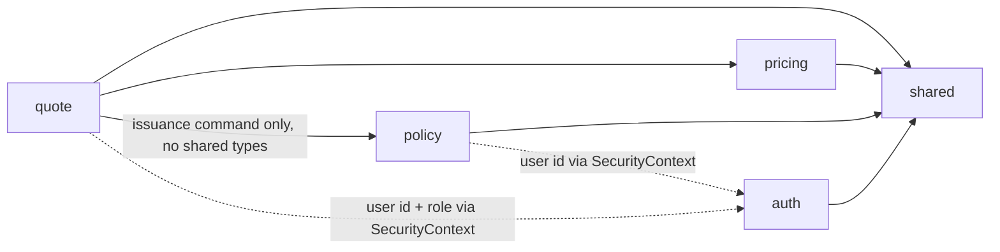
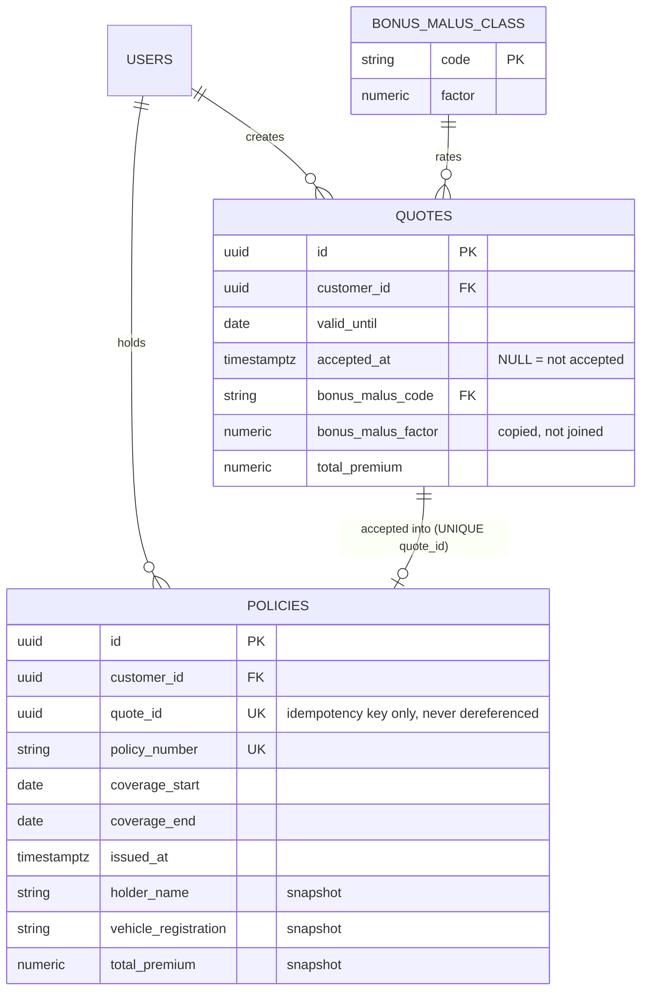

# Architecture Spine — Milestone 3: Quote Lifecycle & Policy Issuance

## Design Paradigm

Unchanged: modular monolith, package-by-feature, each module internally layered `api → application → domain → persistence`.

Milestone 3 adds one module, `policy`, and settles the one structural question the milestone actually poses: **which module owns the acceptance transaction.** The answer shapes everything else here — `quote` owns it; `policy` is a downstream issuer that depends on nothing.

## Inherited Invariants

Binding and read-only. Not re-derived, not renumbered, not weakened.

**From the Milestone 1 spine** — M1 AD-1 (modular monolith, package-by-feature) · M1 AD-2 (cross-module access only through the target's `application` package) · M1 AD-3 (stateless JWT, single access token, no refresh) · M1 AD-4 (backend-enforced authorization; the frontend guard is UX only) · M1 AD-5 (exact-decimal money everywhere) · M1 AD-6 (modules created on demand, not pre-scaffolded) · M1 AD-7 (uniform API error envelope, stable `code`, namespaced `MODULE_REASON`) · M1 AD-8 (i18n is frontend-only; the backend emits codes, never prose) · M1 AD-9 (one Compose file) · M1 AD-10 (React Router, one role-guard, one typed fetch client) · M1 AD-11 (HMAC-signed JWT).

**From the Milestone 2 spine** — M2 AD-1 (Tailwind v4, CSS-first tokens) · M2 AD-2 (component variants via `cva`) · M2 AD-3 (components render native semantic elements) · M2 AD-4 (no automated enforcement of component-library adoption) · M2 AD-5 (`FormField` owns field-error display) · M2 AD-6 (semantic status-color vocabulary).

M1 AD-6 is what authorizes creating `policy` now: this is the story that first needs it.

## Invariants & Rules

### AD-1 — `quote` owns the acceptance transaction; `policy` depends on nothing

- **Binds:** `quote`, `policy`
- **Prevents:** a dependency cycle between the two modules, and two different modules each believing they own the acceptance sequence
- **Rule:** the acceptance use case lives in `quote.application`. It performs the BA §7.3 sequence in one transaction and calls exactly one entry point on `policy.application` to create the policy, passing a fully-formed issuance command — every value the policy needs, already resolved. **`policy` never reads `quote`**: it imports no quote type, holds no repository reference to `quotes`, and issues no query against that table. The dependency is one-directional, `quote → policy`, and `policy`'s only other dependency is `shared`.
- **Consequence to preserve:** when an AGENT issues on behalf of a client in a later milestone, `policy` is reusable unchanged — only the caller differs.



### AD-2 — The REST surface keeps acceptance on the quote

- **Binds:** `quote.api`, `policy.api`, the frontend API client
- **Prevents:** the endpoint drifting to `POST /policies {quoteId}` on one side while the frontend calls the BA-specified path on the other
- **Rule:** acceptance is `POST /api/v1/quotes/{id}/accept` (BA §13.2), served by `quote.api`. Policy reads are `GET /api/v1/policies` and `GET /api/v1/policies/{id}`, served by `policy.api`. A module owns its own URL space; the single exception is this acceptance endpoint, which is a command on a quote that happens to produce a policy — it returns the created policy representation, so one round trip both commits and renders the result.

### AD-3 — Derived status, never stored status

- **Binds:** `quote`, `policy`, every response DTO that carries a status
- **Prevents:** a status column drifting out of sync with the dates that define it, and the batch job that would otherwise be needed to keep it honest
- **Rule:** no `status` column exists on `quotes` or `policies`. Status is computed on read from persisted facts:
  - **Quote:** `accepted_at IS NOT NULL` → `ACCEPTED`; else `today > valid_until` → `EXPIRED`; else `CALCULATED`.
  - **Policy:** `today < coverage_start` → `SCHEDULED`; `today > coverage_end` → `EXPIRED`; else `ACTIVE`.
  - `today` is resolved per AD-6.
- The derivation is implemented **once per module**, in the domain layer, and every read path uses it. `CANCELLED` exists as an enum value in both status types with **no producer and no persisted representation** this milestone — it is reserved, not implemented, and the derivation has no branch for it.

### AD-4 — A policy copies; it never references

- **Binds:** `policy` schema and domain, every policy read path
- **Prevents:** an issued contract silently changing because a tariff row, a quote, or a profile changed underneath it
- **Rule:** `policies` stores its own copy of every value it displays — the full premium breakdown, the rating inputs, the holder identity, the vehicle identity. `policies.quote_id` exists **solely** as the idempotency key (AD-5) and is never dereferenced to render or recompute a policy. There is no JPA association from `Policy` to `Quote`, only a `UUID` column. A policy row is readable and complete with the `quotes` table empty.

### AD-5 — The unique constraint is the idempotency authority, and acceptance is genuinely idempotent

- **Binds:** `quote.application` acceptance use case, `policies` schema
- **Prevents:** two concurrent accepts producing two policies — the failure BA §19 names outright — and a false "idempotent" claim that is actually only duplicate *protection* (a 409 on replay is not idempotency; a caller who legitimately retries a timed-out request must get the same policy back, not an error)
- **Rule:** `policies.quote_id` carries a `UNIQUE` constraint. That constraint — not the application-level pre-check below — is the sole authority that guarantees one policy per quote; the pre-check is an optimization for the uncontended path, never the guarantee, and no reviewer should accept it as one.
- **The accept endpoint's contract is: the first successful call creates and returns the policy; every subsequent call for the same quote returns that same policy, never a second one and never an error solely because a policy already exists.** Concretely:
  1. Application-level pre-check: if the quote is already `ACCEPTED` (`accepted_at IS NOT NULL`), skip straight to reading the existing policy by `quote_id` and return it — no insert attempted, no exception involved. This is the uncontended replay path (e.g. a client retrying after a dropped response) and must return **200**, not 409.
  2. Uncontended new acceptance: validate ownership and expiry, set `accepted_at`, allocate the number, insert the policy in one `@Transactional` method, return **201** with the created policy.
  3. Race (two concurrent accepts pass the pre-check together): the insert is flushed inside its own try/catch (the same `saveAndFlush`-inside-try pattern `QuoteService.calculate` already uses, so the exception surfaces where it can be handled rather than at commit). On `DataIntegrityViolationException` from the `quote_id` unique constraint, the loser does **not** propagate an error — it re-reads the policy by `quote_id` (now visible, the winner having committed) and returns it with the same 200 the pre-check path uses. The winner returns 201.
- **`QUOTE_ALREADY_ACCEPTED` (409) is retired as a name for this path** — returning 409 for an already-accepted quote is duplicate-detection, not idempotency, and this AD requires the latter. `409` stays reserved for `QUOTE_EXPIRED` and any future genuine conflict; an already-accepted quote is a **success** response (200, existing policy), not an error. AD-11 and the M3 PRD's `QUOTE_ALREADY_ACCEPTED` code are updated accordingly — see AD-11.
- **No `status` column is introduced by this rule.** Whether to return the existing policy is still decided from `accepted_at IS NOT NULL` (AD-3); this AD only changes what happens once that's true — return successfully instead of erroring.
- The whole sequence — read quote, validate ownership and expiry, set `accepted_at`, allocate the number, insert the policy — runs in one `@Transactional` method. Any failure leaves neither an accepted quote nor a policy.

### AD-6 — One business time zone, one injectable clock

- **Binds:** `quote`, `policy`, every expiry and coverage comparison
- **Prevents:** one implementer comparing against UTC and another against the JVM default — a divergence that only shows up near midnight and is invisible in tests that use `Instant.now()`
- **Rule:** business dates are evaluated in **`Europe/Sofia`**, configured in one place and injected, never read from the system default. Every service that needs "today" takes an injected `java.time.Clock`; no production code calls `Instant.now()`, `LocalDate.now()`, or `LocalDate.now(ZoneId.systemDefault())` directly.
- **Types:** `LocalDate` for business dates (`valid_until`, `coverage_start`, `coverage_end`) — `DATE` in Postgres. `Instant` for event timestamps (`created_at`, `accepted_at`, `issued_at`) — `TIMESTAMPTZ`, stored UTC. Never mix the two roles in one column.
- **Boundaries are inclusive at both ends.** A quote is acceptable *on* its `valid_until` date. Coverage runs from `coverage_start` through `coverage_end` inclusive, so `coverage_end = coverage_start.plusYears(1).minusDays(1)`. Stated here because inclusive-vs-exclusive is the single most likely place two implementers silently disagree.
- `coverage_start` is an **acceptance** input, not a quote input. It is not known when a quote is calculated and no column for it exists on `quotes`.

### AD-7 — Policy numbers come from a sequence

- **Binds:** `policy`
- **Prevents:** the "read the max and add one" pattern BA §7.4 explicitly rules out, and the duplicate it produces under concurrency
- **Rule:** a dedicated PostgreSQL sequence allocates the numeric part; `policies.policy_number` carries a `UNIQUE` constraint as the backstop. Format is `MI-{year}-{8 digits, zero-padded}`, where `{year}` is the issuance year in the business zone (AD-6). **The sequence is global and never resets per year** — a per-year reset would need coordination and buys nothing, since the year is already in the string. Numbers are therefore unique across years by construction, and gaps are expected and acceptable (a rolled-back transaction consumes a value).

### AD-8 — Bonus-malus is tariff data owned by `pricing`

- **Binds:** `pricing`, `quote`, the seed migration
- **Prevents:** the coefficients being hardcoded in Java — the BA §6.4 anti-pattern the existing tariff already avoids — and the scale being presented as authoritative
- **Rule:** the classes and their coefficients live in their own reference table beside the existing tariff tables, seeded by migration, resolved by `pricing` like every other rating input. A coefficient change is a data change, not a redeploy. An unknown class fails closed as a validation error; it is never defaulted to neutral.
- **Order of operations is fixed:** `one_time_premium = round((base_premium + age_surcharge) × bonus_malus_factor, 2)`, then `total_premium = one_time_premium + installment_fee`. The factor never touches the installment fee, which is a flat administrative charge. Rounding stays HALF_UP to 2 decimals (M1 AD-5).
- **Provenance is carried in the artifact, not just the PRD.** The seed migration's header states that these are the project's own demo coefficients, inherited from the team's prototype, and are not official or regulatorily determined values for the Bulgarian market. The same statement appears wherever the scale is surfaced to a reader — README, OpenAPI description, UI. This is a binding constraint from the M3 PRD (FR-M3-16 provenance constraint), not a stylistic preference.

### AD-9 — Every new column arrives with its backfill

- **Binds:** all Milestone 3 Flyway migrations
- **Prevents:** a nullable-forever column whose meaning quietly becomes "old row" — and the branching every read path then grows to cope with it
- **Rule:** a new column on an existing table is added `NOT NULL` with its backfill in the **same** migration. The only permitted nullable columns are those whose null carries real domain meaning (`quotes.accepted_at` — not accepted). Backfills are arithmetically neutral where they touch money: existing quotes backfill to the neutral bonus-malus class with factor `1.000`, leaving every persisted premium byte-identical.
- Migration numbering continues the existing sequence from `V5`. Each migration's header states which story it belongs to and what it backfills, matching the convention `V3`/`V4` already set.

### AD-10 — Ownership is enforced in the query, and a miss is a 404

- **Binds:** every Milestone 3 read and write path
- **Prevents:** the IDOR that BA §19 lists, and the information leak of a 403 confirming a resource exists
- **Rule:** every repository method that serves a client request takes the customer id as part of the query — `findByIdAndCustomerId`, `findAllByCustomerIdOrderBy…`. No path fetches by id and then compares ownership in Java. A resource that exists but belongs to someone else is indistinguishable from one that does not exist: **404, never 403.** 403 remains reserved for a role mismatch (M1 AD-4), which is a different failure and a different code.
- Every Milestone 3 endpoint carries `@PreAuthorize("hasRole('CLIENT')")`. The customer id comes from the `SecurityContext` principal, never from a request parameter.

### AD-11 — New error codes, and their translations, ship together

- **Binds:** `quote`, `policy`, the frontend i18n catalogs
- **Prevents:** a backend code with no translation — the drift M1 AD-7 already forbids and CI already checks
- **Rule:** new codes are namespaced `MODULE_REASON` per M1 AD-7: `QUOTE_EXPIRED` (409), `POLICY_NOT_FOUND` (404), `PRICING_UNKNOWN_BONUS_MALUS_CLASS` (400). Each lands with its `bg` and `en` entries in the same change; the existing error-code contract check in CI is the gate.
- **`QUOTE_ALREADY_ACCEPTED` does not exist as an error code this milestone** — per AD-5, an already-accepted quote is a successful 200 response carrying the existing policy, not an error. Do not add this code; if a future milestone needs to distinguish a replay from a first acceptance in the response itself, that is a new, explicitly-scoped decision, not a revival of this code.
- HTTP mapping follows BA §13.3 and the codes above: 400 invalid input, 401 no/invalid token, 403 wrong role, 404 not found *or not yours*, 409 expired offer, 200/201 acceptance per AD-5's idempotency contract.

### AD-12 — List responses are plain arrays, ordered, unpaginated

- **Binds:** `GET /api/v1/quotes`, `GET /api/v1/policies`
- **Prevents:** two list endpoints inventing two different envelopes, and a later pagination retrofit breaking whichever one guessed differently
- **Rule:** a list endpoint returns a bare JSON array of the same DTO its detail endpoint returns, ordered newest-first by creation. No wrapper object, no page metadata, no limit parameter this milestone — a client holds a handful of quotes and policies. When pagination is genuinely needed it arrives as a new decision, not by one endpoint quietly growing an envelope.

### AD-13 — The quote response grows additively

- **Binds:** `quote.api`, the frontend quote screens
- **Prevents:** a rename cascading into the existing quote flow and the Milestone 2 screens that already render it
- **Rule:** every field currently on the quote response keeps its name, type, and meaning. Milestone 3 only adds: the offer validity date, the derived status, the bonus-malus class and factor, the acceptance timestamp, and the id of the resulting policy when one exists. The existing breakdown component keeps working untouched; the new fields are what the new screens consume.

## Consistency Conventions

| Concern | Convention |
| --- | --- |
| Naming | Inherited: Java `com.motorinsurance.{module}.{layer}`; REST `/api/v1/{resource}`; Flyway `V{n}__{description}.sql`; tables `snake_case`, plural. |
| Data & formats | IDs `UUID`. Business dates `LocalDate`/`DATE`. Timestamps `Instant`/`TIMESTAMPTZ` UTC. Money `BigDecimal`/`NUMERIC`, HALF_UP to 2 decimals. Factors `NUMERIC(4,3)`. Errors: the M1 AD-7 envelope. |
| State & cross-cutting | Mutation only inside an `application`-layer `@Transactional` method. Status derived, never stored (AD-3). Clock injected, business zone `Europe/Sofia` (AD-6). Ownership in the query (AD-10). |
| Frontend | Inherited M1 AD-10 and every M2 convention. New screens compose the existing `components/ui` primitives; the one new primitive is `Badge`, per the UX spines. New i18n namespaces `quotes.*` and `policies.*`. |

## Stack

No change. Java 21 · Spring Boot 4.1.1 · Maven · PostgreSQL 18 · Flyway · React 19 · TypeScript 6 · Vite 8 · React Router 8 · react-i18next · Tailwind v4 · Docker Compose.

**One addition, should-have:** `springdoc-openapi` for FR-M3-14. Verify the current release line against Spring Boot 4.1.x before binding it — Spring Boot 4 is recent enough that the compatible springdoc major is the thing to confirm, not assume. If no compatible release exists yet, FR-M3-14 defers rather than pinning the framework backwards; it is a should-have precisely so it cannot hold the milestone.

## Structural Seed

```text
backend/src/main/java/com/motorinsurance/
  quote/
    api/            + accept endpoint, acceptance request DTO, extended quote response
    application/    + acceptance use case (owns the transaction, AD-1)
    domain/         + status derivation, offer validity
    persistence/    + owner-scoped list query
  policy/           NEW — api/application/domain/persistence
    application/      one issuance entry point (AD-1), owner-scoped reads
    domain/           Policy, number formatting, status derivation
  pricing/
    domain/         + bonus-malus class
    persistence/    + bonus-malus repository
  shared/           unchanged
  src/main/resources/db/migration/
    V6..            bonus-malus table + quotes columns + backfill;
                    quote lifecycle columns + backfill; policies table
                    (one migration per story, AD-9)

frontend/src/
  components/ui/Badge.tsx        NEW — the only new primitive
  features/quote/                + list, detail, acceptance
  features/policy/               NEW — list, detail
  i18n/                          + quotes.*, policies.*
```



Illustrative, not exhaustive. The full policy snapshot carries every breakdown component the quote carries — that column list is a story-level concern, fixed only by AD-4's rule that it is copied rather than joined.

## Capability → Architecture Map

| PRD requirement | Where it is settled |
| --- | --- |
| FR-M3-01 quote history | AD-10 (owner-scoped query), AD-12 (list shape) |
| FR-M3-02 offer validity | AD-6 (type, zone, inclusivity), AD-9 (backfill) |
| FR-M3-03 quote status | AD-3 (derived) |
| FR-M3-04 coverage start | AD-6 (acceptance input, inclusive end) |
| FR-M3-05 accept → issue | AD-1 (ownership of the transaction), AD-5 (idempotency, concurrency) |
| FR-M3-06 policy number | AD-7 |
| FR-M3-07 immutable snapshot | AD-4 |
| FR-M3-08 identity capture | AD-4 (stored as snapshot), AD-1 (arrives in the issuance command) |
| FR-M3-09 policy status | AD-3 |
| FR-M3-10 my policies | AD-2 (URL space), AD-10, AD-12 |
| FR-M3-11..13 session robustness | Frontend only; inherited M1 AD-10 — no new backend decision |
| FR-M3-14 OpenAPI | Stack, deferred if incompatible |
| FR-M3-16 bonus-malus | AD-8 (data, order of operations, provenance), AD-9 (backfill), AD-13 (response shape) |

## Deferred

- **Pagination and filtering on the list endpoints** — AD-12 fixes the shape; volume does not yet justify the mechanism.
- **Quote and policy cancellation** — `CANCELLED` is reserved in both enums (AD-3) with no producer. The column and the operation arrive with the story that needs them.
- **`CustomerProfile` and `Vehicle` as first-class entities** — M3 PRD decision D-2. Identity is a snapshot on the policy; the entities arrive when the agent workflow needs lookup.
- **Tariff versioning** — the bonus-malus table (AD-8) joins the existing unversioned tariff tables. Which tariff version priced a quote stays unrecorded until the versioning milestone.
- **`claim`, `notification` modules and file storage** — Milestone 4; M1 AD-6 keeps them uncreated until then.
- **A payment or invoicing model** — `installment_amount` stays the nominal display figure M1 defined.
- **Materialized status and any scheduler** — AD-3 removes the need. If a future requirement genuinely needs a stored status (e.g. an event on expiry), that is a new decision, not a quiet column.
- **Refresh tokens, rate limiting, revocation** — still a PRD non-goal; M1 AD-3 unchanged.
- **Deployment hardening** (ungated staff seed, secrets posture) — deferred by the M3 PRD's local-only decision, with the stated trigger: it becomes blocking the moment a public deployment is planned.
