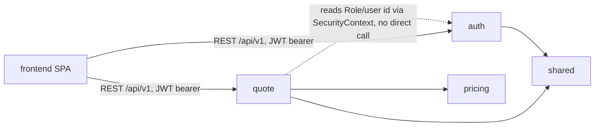
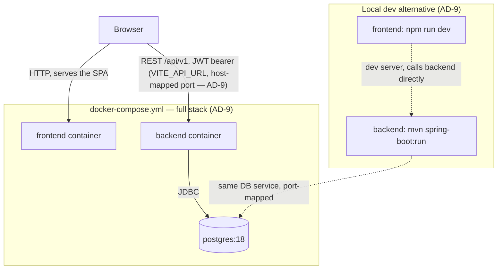
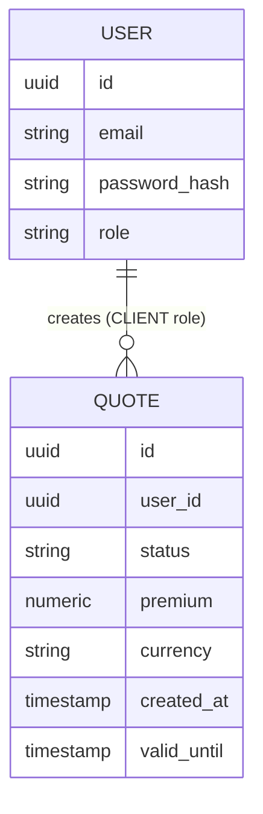

# Architecture Spine — Motor Insurance Portal — Milestone 1 Skeleton

## Design Paradigm

Modular monolith: one deployable Spring Boot process, split into top-level Java packages by business capability (not by technical layer). Each module is internally layered:

```text
{module}/
  api/           # controllers, request/response DTOs
  application/   # use-case services, orchestration, transactions
  domain/        # entities, value objects, business rules
  persistence/   # JPA repositories, entity mappings
```

The frontend is a separate SPA (React) consuming the backend exclusively over REST `/api/v1`; it has no server-side rendering or backend-coupled build step.

## Invariants & Rules

### AD-1 — Modular monolith, package-by-feature [ADOPTED]

- **Binds:** all backend code
- **Prevents:** a single tangled package, and premature microservice-splitting
- **Rule:** the backend is one Spring Boot application. Each business capability is a top-level package under `com.motorinsurance` (or the team's chosen group id — see Stack). A module is created only per AD-6, not pre-scaffolded.

### AD-2 — Module boundary enforcement

- **Binds:** all backend modules
- **Prevents:** hidden coupling — one module reaching into another's persistence or domain internals, which two independently-built modules could easily do differently (direct repository call vs. going through a service)
- **Rule:** cross-module access happens only through the target module's `application` package (its public service classes/methods). No module imports another module's `domain` or `persistence` package. A module reads "who is the current user" from the Spring Security context (set by `auth`'s JWT filter), never by calling `auth`'s services directly. This applies even to a module with no `api`/`persistence` layer of its own — e.g. `pricing` (AD-1 exception noted in Structural Seed) still exposes exactly one `application`-layer calculation service as its only entry point; its `domain` classes are never imported directly by `quote` or any other module.



### AD-3 — Stateless JWT, single access token, no refresh

- **Binds:** `auth` module, every protected endpoint
- **Prevents:** refresh-token storage/rotation/revocation complexity the PRD explicitly excludes from this milestone (Non-Goals: production-grade auth hardening)
- **Rule:** login issues exactly one JWT carrying (at minimum) user id and Role, with a multi-hour expiry sized for a dev/demo session. No refresh endpoint or refresh-token store exists this milestone. Every protected endpoint validates the token via one shared filter — no per-controller token parsing.

### AD-4 — Backend-enforced authorization; frontend guard is UX only

- **Binds:** `auth`, every module with role-restricted endpoints, frontend routing
- **Prevents:** security-by-obscurity — a hidden frontend route is not a protected endpoint
- **Rule:** every Role-restricted endpoint independently checks the caller's Role server-side (403 on mismatch, 401 on missing/invalid token) regardless of what the frontend does. The frontend's role-guard component (AD-10) exists purely to route the user correctly, never as the security boundary.

### AD-5 — Exact-decimal money, everywhere [ADOPTED]

- **Binds:** `quote`/`pricing`, any future money-handling module
- **Prevents:** floating-point rounding drift in premiums
- **Rule:** `BigDecimal` for every monetary value in Java; `NUMERIC` (never `FLOAT`/`DOUBLE`) in PostgreSQL. No monetary value is ever represented as a binary float at any layer, including API JSON (serialized as a decimal string/number, not passed through floating-point arithmetic on the way).

### AD-6 — Modules are created on demand, not pre-scaffolded

- **Binds:** `customer`, `vehicle`, `policy`, `claim`, `notification`, `tariff` (none exist yet)
- **Prevents:** empty, unowned packages accumulating drift before any real capability needs them
- **Rule:** a module's package is created in the same story that adds its first real capability — not before. This milestone only needs `auth`, `quote`, `pricing`, and `shared`.

### AD-7 — Uniform API error envelope

- **Binds:** all backend modules
- **Prevents:** ad hoc per-endpoint error shapes that the frontend can't map to translations (blocks FR-15)
- **Rule:** every error response is shaped `{timestamp, status, code, message, fieldErrors}`, produced by exactly one centralized exception-handling component (`shared` module). `code` is a stable, language-independent key — the only thing the frontend uses to select translated text. `message` is developer/log-facing only and is never rendered to an end user directly. `code` values are namespaced `MODULE_REASON` (e.g. `QUOTE_VALIDATION_ERROR`, `AUTH_INVALID_CREDENTIALS`) and every `code` a backend module can emit has exactly one matching entry under that module's i18n namespace (AD-8) — a new `code` and its translation are added in the same change, never one without the other.

### AD-8 — i18n is a frontend-only concern

- **Binds:** frontend, backend API contracts
- **Prevents:** backend Accept-Language handling / message bundles, and partial localization drift between layers
- **Rule:** the backend never emits user-facing localized prose — only stable codes (AD-7) and structural data. The frontend (`react-i18next`) owns 100% of translation, keyed off those codes plus its own UI copy. Bulgarian is the default locale; English is a toggle; the selection persists client-side only (no server-side per-account preference this milestone).

### AD-9 — One Compose file, partial start for local dev

- **Binds:** `docker-compose.yml`, `backend/Dockerfile`, `frontend/Dockerfile`
- **Prevents:** divergent per-environment compose files or undocumented manual setup steps
- **Rule:** a single `docker-compose.yml` at repo root defines `postgres`, `backend`, `frontend` services. `docker compose up` starts the full stack from a clean checkout (binds FR-12). `docker compose up postgres` starts only the database, for the local dev loop where backend/frontend run natively (`mvn spring-boot:run` / `npm run dev`) against that same containerized Postgres (binds FR-13). The frontend's API base URL is never hardcoded: it is injected as a build/runtime variable (`VITE_API_URL`), set to the browser-reachable backend origin in both modes — the containerized frontend must resolve the backend by its host-mapped port (the browser is outside the Compose network and cannot resolve a service name like `backend`), and native dev resolves it the same way. This is the same mechanism in both AD-9 and AD-10 — one env var, not two conventions.

### AD-10 — Frontend routing, guarding, and data access

- **Binds:** frontend
- **Prevents:** inconsistent per-screen auth checks and data-fetching patterns across independently-built screens
- **Rule:** React Router v8 owns all routing. One role-guard wrapper component gates role-restricted routes (pairs with AD-4) — no per-screen ad hoc role checks. All backend calls go through one small typed API client module wrapping `fetch`; no data-fetching library (e.g. React Query) this milestone — too few screens to justify it.

### AD-11 — JWT signing mechanism

- **Binds:** `auth` module (token issuance), `shared` module (the one token-validation filter, per AD-3)
- **Prevents:** the signing algorithm and secret source being invented ad hoc by whoever implements Story 1.3, with no record of the choice
- **Rule:** tokens are signed with a single symmetric key (HMAC, e.g. HS256) — there is exactly one backend issuing and validating tokens this milestone, so asymmetric key-pair signing buys nothing. The signing secret is read from an environment variable (documented, with no real value, in `.env.example` per NFR-2/AD-9), never hardcoded or committed. Rotating the secret invalidates all outstanding tokens — acceptable for a milestone with no refresh-token mechanism (AD-3).

## Consistency Conventions

| Concern | Convention |
| --- | --- |
| Naming (entities, files, packages) | Java packages `com.motorinsurance.{module}.{layer}`; REST paths `/api/v1/{resource}`; Flyway migrations `V{n}__{description}.sql`; DB tables `snake_case`, plural. |
| Data & formats | IDs: `UUID`. Business dates: `LocalDate`. Timestamps: `Instant`, stored UTC. Money: `BigDecimal` / `NUMERIC` (AD-5). Errors: the envelope in AD-7. |
| State & cross-cutting | Entity mutation only inside an `application`-layer service method (never directly from a controller or from another module — AD-2). Auth: `Authorization: Bearer <jwt>` header (AD-3), validated by one shared filter. Secrets: `.env`, never committed; `.env.example` documents required keys with no real values. i18n keys: namespaced per frontend feature (`auth.*`, `quote.*`, `shells.*`) in `react-i18next` catalogs. |

## Stack

| Name | Version |
| --- | --- |
| Java | 21 |
| Spring Boot | 4.1.1 |
| Build tool | Maven |
| PostgreSQL | 18 |
| Flyway | version managed by Spring Boot 4.1.1 BOM |
| React | 19 |
| TypeScript | 6.x |
| Vite | 8 |
| React Router | 8 |
| i18n | react-i18next |
| Container runtime | Docker + Docker Compose |

## Structural Seed

```text
{repo-root}/
  backend/
    src/main/java/com/motorinsurance/
      auth/            # api/application/domain/persistence — User, Role, registration (CLIENT only), login, JWT issuance
      quote/           # api/application/domain/persistence — Quote calculation, breakdown, persistence, retrieval
      pricing/         # domain — tariff factors + formula (AD-6: created now because quote needs it)
      shared/          # ApiError + centralized exception handler (AD-7), security/JWT filter config, base config
    src/main/resources/
      db/migration/    # Flyway V{n}__*.sql — one per module's schema additions
    src/test/java/...  # mirrors main tree
    Dockerfile
  frontend/
    src/
      app/             # router setup, role-guard wrapper (AD-10), root layout
      features/
        auth/          # login screen, registration screen (CLIENT only)
        quote/         # quote form, result/breakdown screen
        shells/        # static placeholder screens: agent/, liquidator/, administrator/
      i18n/            # react-i18next setup; bg.json, en.json catalogs
      api/             # typed fetch client (AD-10)
    Dockerfile
  docs/                # existing business analysis, UML, ADRs, this PRD/spine's sources
  docker-compose.yml   # postgres + backend + frontend (AD-9)
  .env.example
```



Illustrative only — not the exhaustive schema. `QUOTE` will carry the full driver/vehicle input set and per-factor breakdown (FR-8–FR-10); that column-level detail is a story-level concern, not fixed here.



## Deferred

- **Refresh-token / rotation / revocation strategy** — out of scope until a real auth-hardening milestone (PRD Non-Goals); AD-3 fixes only the single-token shape needed now.
- **`customer`, `vehicle`, `policy`, `claim`, `notification`, `tariff` internal design** — each deferred to the story that first needs it (AD-6); this spine does not anticipate their shape.
- **Tariff versioning / admin data model** (`TariffVersion`, `TariffFactor` tables, DRAFT/ACTIVE/RETIRED lifecycle) — business analysis §6.4–6.5 describes the eventual target; Milestone 1's `pricing` module uses one hardcoded formula (PRD addendum) with no persistence of its own.
- **Server-side / per-account persisted language preference** — PRD FR-14 assumption; AD-8 fixes client-side-only for now.
- **Rate limiting, login lockout, auth audit logging** — explicit PRD Non-Goal for this milestone.
- **Observability/monitoring stack** — no requirement this milestone beyond whatever Spring Boot Actuator ships with by default; not elevated to an AD.
- **CI pipeline detail** — the team's earlier prototype already proved a working pattern (backend `mvn verify`, frontend typecheck + build, on every PR); reuse it as a story-level task, not re-derived here.
- **Seed migration mechanics for staff demo accounts** (FR-4) — that a seeded `Flyway` migration hashes passwords rather than storing them plain is required by AD-5's sibling security baseline (PRD Cross-Cutting NFRs), but which migration file, exact seeded emails/roles, and hash-generation approach are left to the `auth` module's implementing story.
