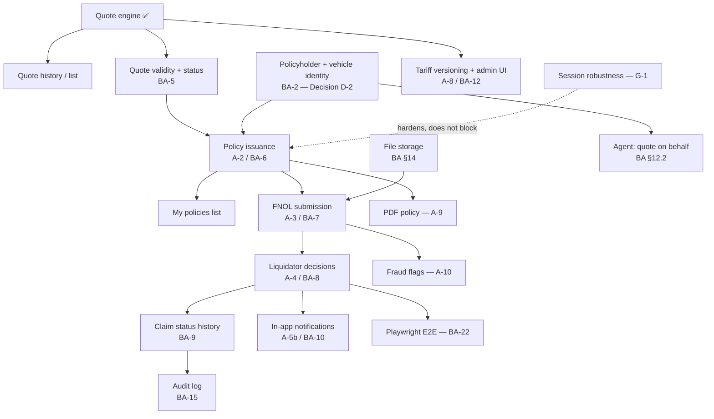

# Post-Milestone-2 Gap Analysis & Roadmap

## 0. Document Purpose

Milestones 1 and 2 are complete and merged (`dev` == `main` at `b393df8`; all five epics `done` in `sprint-status.yaml`). This document does two things:

1. **Traceability and gap analysis** — every requirement from `assignment.md` and `docs/motor_insurance_portal_business_analysis.md` (the two requirement sources of record), plus the Milestone 1 and Milestone 2 PRDs, mapped against what actually exists in the merged codebase.
2. **A roadmap** — the remaining work grouped into milestones defined by user value, with **Milestone 3 detailed to implementation readiness** and Milestones 4–6 deliberately left at roadmap altitude.

It does not restate Milestone 1's or Milestone 2's requirements; both of those PRDs stay final and untouched. Where this document narrows or reinterprets the business analysis, that is called out explicitly.

**Provenance rule.** Nothing in §3–§4 is invented. Every requirement carries a source tag:

- `[ASSIGNMENT]` — stated in `assignment.md`
- `[BA §n]` — stated in the business analysis at that section
- `[M1-PRD]` / `[M2-PRD]` — carried forward from a completed milestone's PRD (usually as an explicit out-of-scope item)
- `[DEFERRED]` — logged in `deferred-work.md` or a retrospective action item
- `[NEW]` — a recommendation of this document, with its rationale stated inline

---

## 1. Where the Product Stands

**Working today, end to end:** a visitor registers as a CLIENT, logs in, and receives a JWT carrying their role. Every protected endpoint checks that role server-side. Three staff accounts are seeded by migration; each of the four roles lands on its own guarded route. A CLIENT fills in a quote form (driver age, region code, engine cc, installments) and gets back a persisted quote with a full premium breakdown priced from real, data-driven Bulgarian GO tariff tables. Every screen renders in Bulgarian or English with no untranslated fallback, is built from a Tailwind-token design system with a shared component library, and is usable from ~375px up. The whole stack starts with one `docker compose up`; CI runs backend tests, frontend typecheck/test/build, an error-code contract check, and a Compose smoke test.

**Not built at all:** policies, claims, notifications, tariff administration, and every staff workflow beyond "you land on your own page". The backend has four modules (`auth`, `quote`, `pricing`, `shared`) and five migrations. There is no `policy`, `claim`, `notification`, `customer`, `vehicle`, or `tariff` module — deliberately, per AD-6 (modules are created by the story that first needs them).

The gap, stated plainly: **the assignment's headline deliverable is the `quote → policy → claim → decision` flow. One of those four stages exists.**

---

## 2. Requirements Traceability & Gap Analysis

### 2.1 How to read the tables

| Column | Meaning |
|---|---|
| **State** | ✅ Full · 🟡 Partial · ❌ Missing |
| **Class** | **M** Must-have (release-blocking for the assignment) · **S** Should-have · **C** Could-have / stretch · **T** Technical maintenance |
| **Where** | The milestone this document proposes it land in |

"Release-blocking" means: without it, the portal does not deliver what `assignment.md` describes under **Основен обхват (must-have)** and **Резултат**.

### 2.2 Assignment requirements (`assignment.md`)

| ID | Requirement | State | Evidence | Class | Where |
|---|---|---|---|---|---|
| A-1 | Quote engine — premium by parameters | 🟡 | `PricingService` + `tariff_zone`/`region_zone_map`/`tariff_rate`/`age_surcharge`/`installment_plan` price from driver age, region code, engine cc, installments. **Driving experience and bonus-malus are absent**; engine cc stands in for мощност. This is a documented, deliberate team substitution (M1 addendum, 2026-08-26: a real GO tariff replaced the placeholder multiplicative formula) — but the assignment names стаж and бонус-малус explicitly. **Resolved by D-1: bonus-malus is added in M3 (FR-M3-16); driving experience stays out as a documented deviation.** | M | **M3** |
| A-2 | Policy issuance from an accepted quote, with a unique number and coverage period | ❌ | No `policy` module, no `policies` table, no accept endpoint. Quotes have no status and no validity window. | M | **M3** |
| A-3 | FNOL — description, date, photos, processing status | ❌ | No `claim` module, no file storage, no attachment handling anywhere in the stack. | M | M4 |
| A-4 | Liquidator workflow — review, approve/reject, paid amount | ❌ | `LiquidatorShell.tsx` is a static "coming soon" placeholder. | M | M4 |
| A-5a | Roles: client, agent, liquidator (+ administrator) | ✅ | `Role` enum, seeded staff accounts (V5), `@PreAuthorize`, `RoleGuard`, per-role routes. | M | done |
| A-5b | Notifications on status change | ❌ | No `notification` module, no `notifications` table, no in-app notification UI. Depends entirely on A-3/A-4 existing first. | M | M4 |
| A-6 | Configurable tariff | ✅ | Tariff lives as data in five tables, not as `if/else` in Java — correctable without a redeploy. Satisfies the assignment's «конфигурируема тарифа» literally. An *admin UI* over it is BA Should-have, not this. | M | done |
| A-7 | README | ✅ | Root + `backend/` + `frontend/` READMEs. **Caveat:** the root README's "Status" section is stale — it says "Epic 1 complete, Epic 2 in progress" when all five epics are done. | T | M3 |
| A-8 | Bonus — tariff versions with time validity | ❌ | Tariff tables have no version, no `validFrom`/`validTo`, no DRAFT/ACTIVE/RETIRED lifecycle. Quotes do not record which tariff priced them. | C | M5 |
| A-9 | Bonus — auto-generated PDF policy | ❌ | — | C | M6 |
| A-10 | Bonus — simple fraud flags by heuristic | ❌ | Depends on claims existing. | C | M6 |

### 2.3 Business-analysis MVP list (`docs/…business_analysis.md` §17)

**Must-have per the BA:**

| ID | Requirement | State | Evidence | Class | Where |
|---|---|---|---|---|---|
| BA-1 | Registration, login, roles | ✅ | Epic 1 + Epic 2. | M | done |
| BA-2 | Driver profile and vehicle | ❌ | No `CustomerProfile`, no `Vehicle`. Registration collects email + password only; the quote form collects rating inputs, not identity. A policy needs a holder and a vehicle to be credible, and a claim needs a policy. **Resolved by D-2: satisfied in M3 as a snapshot at acceptance (FR-M3-08), not as first-class entities.** | M | **M3** |
| BA-3 | Active tariff | ✅ | Seeded in V3, data-driven. *Versioned* tariff is A-8 (stretch). | M | done |
| BA-4 | Quote Engine | 🟡 | See A-1. | M | **M3** |
| BA-5 | Quote with validity | ❌ | `quotes` has no `valid_until` and no `status`, despite the M1 PRD glossary defining a Quote as carrying "a validity window". A live gap between the M1 glossary and the shipped schema. | M | **M3** |
| BA-6 | Accept quote → issue policy | ❌ | = A-2. Needs the §7.3 transactional recipe: ownership check, expiry check, no-existing-policy check, mark accepted, create policy, generate number, snapshot. | M | **M3** |
| BA-7 | FNOL form + photos | ❌ | = A-3. Needs BA §14 file storage (local dir or MinIO; DB stores `storageKey`/MIME/size/hash only). | M | M4 |
| BA-8 | Liquidator workflow | ❌ | = A-4. Needs BA §8.4 transition rules as business operations (`start-review`/`approve`/`reject`/`mark-paid`), not a generic status setter. | M | M4 |
| BA-9 | Status history | ❌ | No `ClaimStatusHistory`. | M | M4 |
| BA-10 | In-app notifications | ❌ | = A-5b. BA §9 design: `claim` publishes `ClaimStatusChanged`, `notification` persists a row, React polls unread. Spring application events, no broker. | M | M4 |
| BA-11 | README and startup instructions | ✅ | = A-7. | M | done |

**Should-have per the BA:**

| ID | Requirement | State | Class | Where |
|---|---|---|---|---|
| BA-12 | Admin UI for the tariff | ❌ | S | M5 |
| BA-13 | Claim filtering (status / date / client) | ❌ | S | M5 |
| BA-14 | Optimistic locking on claim processing | ❌ | S | M4 — folded into the liquidator workflow; two liquidators acting on one claim is exactly the race BA §19 warns about |
| BA-15 | Audit log | ❌ | S | M5 |
| BA-16 | Responsive UI | ✅ | S | done (M2 Story 5.5) |
| BA-17 | Detailed price breakdown | ✅ | S | done (M1 FR-9) |

**Stretch per the BA:** full tariff versioning (A-8), PDF policy (A-9), fraud flags (A-10), email notifications, KPI dashboard — all ❌, all Could-have, all M6 or later.

**Cross-cutting BA requirements not yet met:**

| ID | Requirement | State | Evidence | Class | Where |
|---|---|---|---|---|---|
| BA-18 | Swagger / OpenAPI API documentation (§13.3) | ❌ | No `springdoc-openapi` dependency. Also mentor question #4 in `docs/questions.md`. | S | **M3** — cheap now, and the API surface roughly triples across M3–M4 |
| BA-19 | Rate limiting on login and sensitive operations (§15) | ❌ | Explicit M1 non-goal. | S | M5 |
| BA-20 | IDOR protection — no access to other users' records (§15) | ✅ | `findByIdAndCustomerId` — every quote read is owner-scoped. **Must be preserved** by every new endpoint in M3/M4. | M | ongoing |
| BA-21 | Explicit rounding rule, `BigDecimal`/`NUMERIC` everywhere (§15) | ✅ | HALF_UP to 2 decimals, AD-5 enforced. | M | done |
| BA-22 | End-to-end Playwright scenario (§16.5) | ❌ | No E2E harness. The BA proposes it as the demo script; it only becomes meaningful once the full chain exists. | S | M4 (end of) |

### 2.4 Milestone 1 & Milestone 2 PRD requirements

**Milestone 1 (FR-1 … FR-15): all ✅.** Registration, login, backend role enforcement, seeded staff, role routing, placeholder shells, route guards, quote calculation, breakdown, persistence, single-ID retrieval, one-command Docker startup, preserved local dev, language toggle, language-agnostic backend. Verified against the merged tree.

**Milestone 2 (FR-1 … FR-9): all ✅, with one open caveat.** Design tokens, component library, auth/quote/nav/shell visual passes, responsive layout, and the should-have loading/error polish all shipped. Epic 5's retrospective closed as `accepted-with-open-items`, and **M2 FR-1 ("no hardcoded hex in touched screens") is not literally true**: a `#e2e8f0` border still renders above the quote breakdown card via a surviving `@layer legacy` rule in `index.css` (retro items 36–38). Cosmetic and non-blocking, but Milestone 2's own acceptance criterion stays technically unmet until the legacy-CSS retirement lands.

### 2.5 Technical maintenance backlog

`deferred-work.md` holds **79 entries** and `sprint-status.yaml` holds **20 open action items**. Nearly all are non-blocking. Grouped by what they actually threaten:

| Group | Representative items | Class | Recommendation |
|---|---|---|---|
| **G-1 — Session/auth robustness** | Expired-but-decodable token renders an authenticated UI (`RoleGuard`, `RootLayout`); no 401 → clear-token → redirect path; `/login`+`/register` don't redirect an already-authenticated visitor (retro item 13); cross-tab token changes don't propagate; no token revocation on role change (8h JWT window) | **T→M** | **Fold the first three into Milestone 3.** Once a click issues a real policy, "the UI thinks you're logged in but the backend disagrees" stops being cosmetic. The rest stay deferred. |
| **G-2 — Legacy CSS retirement** | Retro items 36–38: delete dead `@layer legacy` rules, migrate the four survivors, reconcile M2 FR-1 | T | Fold into Milestone 3 as a small chore. Closes M2's own acceptance gap. |
| **G-3 — Test coverage holes** | `HealthStatus.tsx` has zero tests and Story 5.6 rewrote it (retro items 34, 43); no `RoleGuard` isolation test; no JWT-role-claim contract test frontend↔backend (retro item 12); no coverage tooling at all | T | Item 43 into Milestone 3; the rest run as opportunistic cleanup. |
| **G-4 — Form/a11y duplication** | `cancelledRef` + `FormPhase` + double-submit guard duplicated verbatim across three forms; no `aria-describedby` on errored fields; no focus management on submit failure; no required-field indicator; no skip-to-content link | T/S | Extract the shared form hook **when Milestone 3 adds its second new form** — that is the point where a fourth verbatim copy becomes indefensible (Epic 5 retro item 41). **The accessibility items in this group stay deferred indefinitely** — confirmed with the product owner on 2026-08-31 that the mentor treats accessibility as a bonus, not a graded requirement, and remaining time goes to core logic. Semantic HTML from the M2 component library remains the floor; nothing beyond it is planned. |
| **G-5 — Backend hardening** | BCrypt 72-byte truncation unhandled; case-sensitive `Bearer` prefix; no overlap constraint on tariff ranges; `V5` staff seed is ungated for any database; `quotes.customer_id` has no `ON DELETE`; no PII/retention stance | T/S | **All deferred.** The product owner confirmed on 2026-08-31 that the target stays local-only for this assignment; a public deployment is a stretch goal to revisit only if time remains. The ungated `V5` seed and the JWT-secret guard are therefore not escalated — but **both become release-blocking the moment a public deployment is on the table**, and that trigger is recorded here so it is not rediscovered late. |
| **G-6 — Docker/CI polish** | Frontend `depends_on` not health-gated (item 23); `VITE_API_URL` not derived from `BACKEND_PORT` (item 24); no nginx security headers; no dependency scanning | T | Deferred. CI already smoke-tests the Compose stack, which was the real risk. |
| **G-7 — Docs drift** | Root README "Status" section stale by three epics; stale comments in `index.css`, `authToken.ts`, `epic-2-context.md` | T | The root README fix belongs in Milestone 3 — it is the assignment's A-7 deliverable. |
| **G-8 — Process** | Retro item 40: `sprint-status.yaml` lagged an entire epic because story keys were never moved to `done` on merge | T | Adopt in Milestone 3's working agreement. |

### 2.6 Dependencies between the remaining items

**The critical path is one chain:** quote validity → policy issuance → FNOL → liquidator decisions → notifications. Nothing else on the list unblocks anything on it. Tariff versioning, the admin UI, the agent workflow, audit logging, PDF, and fraud flags all hang off the side and can be sequenced freely once the chain is complete.

**Two things gated the front of the chain; both are now decided.** The quote engine gains bonus-malus (**D-1**, FR-M3-16 — the first story of the milestone), and policyholder/vehicle identity is captured as a snapshot at acceptance rather than as first-class entities (**D-2**, FR-M3-08).

---

## 3. Proposed Roadmap

Milestones are named for the user-visible capability they deliver, not the layer they touch.

| # | Name | The user can… | Closes | Altitude here |
|---|---|---|---|---|
| **M3** | **From quote to policy** | See their past quotes, accept a valid one, and hold a real policy with a number and a coverage period | A-2, BA-2, BA-5, BA-6, G-1 | **Detailed (§4)** |
| **M4** | **File a claim and get a decision** | File an FNOL with photos against their policy, track its status, and be notified as a liquidator moves it through review → approved/rejected → paid | A-3, A-4, A-5b, BA-7…BA-10, BA-14 | Roadmap only |
| **M5** | **Staff do real work** | Agents quote on behalf of a client; administrators edit and activate tariff versions; liquidators filter their queue; decisions are auditable | A-8, BA-12, BA-13, BA-15, BA-19 | Roadmap only |
| **M6** | **Paperwork and signals** | Download a PDF policy; liquidators see fraud flags with reasons; notifications reach email | A-9, A-10, BA stretch | Roadmap only |

**M4 sketch (deliberately not over-planned).** One coherent milestone, because a claim nobody can decide on has no user value and a decision on a claim nobody can file has no subject. Rough shape: file storage (BA §14 — a local volume behind a permission-checked download endpoint, with `storageKey`/MIME/size/hash in Postgres, an allowlist, a size cap, and real MIME sniffing); FNOL submission validated against the policy's coverage period *on the incident date* (BA §8.2), not merely "is the policy active now"; the five MVP statuses with backend-enforced transitions exposed as business operations (`start-review`/`approve`/`reject`/`mark-paid`), never a generic status setter; `ClaimStatusHistory` on every transition; a liquidator queue; optimistic locking; and in-app notifications driven by a Spring application event. Close it with the BA §16.5 Playwright scenario as the demo script. **Bounded by §6 Q-4's scope constraint:** the filer is always the authenticated policyholder; third-party filing is out of scope and the milestone is documented as such.

**M5 and M6 stay one line each on purpose.** Their shape depends on what M3 and M4 teach us. The BA flags the agent role as under-defined (§4: «Ролята агент не е подробно дефинирана в условието»); a working definition is fixed in §6 Q-5 so M5 is plannable, but it stays a planning decision to re-confirm rather than a settled requirement.

**Ordering rationale.** M3 before M4 because policy is a hard dependency of claims. Staff workflows (M5) after the client chain because the assignment's must-have list is the *flow*, and the liquidator — the one staff workflow the assignment names outright — already sits inside M4. Visual polish gets no further milestone: M2 built the design system, and every new M3/M4 screen consumes it rather than reinventing it.

---

## 4. Milestone 3 — From Quote to Policy *(detailed)*

### 4.1 Vision

Today a client can be told what insurance would cost. They cannot buy it. Milestone 3 closes the first half of the assignment's headline flow: a quote stops being a disposable calculation and becomes an offer with a lifetime, an owner, and an outcome — accepted into a policy with a real number and a real coverage period, or expired.

When this milestone ships, the mentor demo becomes: *register → quote → see my quotes → accept one → hold a policy* — a complete, self-contained commercial transaction, and the precondition for every claim in Milestone 4.

### 4.2 Key User Journeys

- **UJ-4. Elena accepts the quote she got last week.**
  - **Persona + context:** Elena (from M1's UJ-1) quoted her car a few days ago and has decided to go ahead.
  - **Entry state:** Logged in as CLIENT, on her client workspace.
  - **Path:** Opens "My quotes" → sees her quotes newest-first, each showing the total, the vehicle it was for, and how long it stays valid → opens the one she wants → reviews the same breakdown she saw at calculation time → enters her name and the vehicle's registration number → confirms the coverage start date → accepts.
  - **Climax:** The system issues a policy: a unique number in `MI-2026-00000001` form, a coverage period, and the premium she was quoted — not a recalculated one.
  - **Resolution:** The policy appears under "My policies". The quote is now marked accepted and cannot be accepted a second time.
  - **Edge case A:** She double-clicks Accept. Exactly one policy exists afterwards.
  - **Edge case B:** She comes back after the quote has expired. Accept is refused with a clear, translated explanation and an offer to calculate a fresh quote — not a generic error.

- **UJ-5. Elena's session quietly expired.**
  - **Persona + context:** Elena left the tab open overnight; her JWT lapsed.
  - **Entry state:** The tab still shows her authenticated workspace.
  - **Path:** She clicks Accept.
  - **Climax:** Instead of a silent failure or a confusing error, she is returned to the login screen with her stored token cleared.
  - **Resolution:** She logs back in and completes the acceptance. No policy was half-created.

### 4.3 Glossary (deltas only)

- **Offer validity** — the window during which a Quote can still be accepted. Fixed at calculation time and stored on the quote; never recomputed later.
- **Quote status** — `CALCULATED` → `ACCEPTED` | `EXPIRED` | `CANCELLED` (BA §7.1). Backend-controlled; never chosen by the caller.
- **Policy** — the contract issued from an accepted Quote: unique number, coverage period, premium, and an immutable snapshot of the holder, the vehicle, and the pricing that produced it.
- **Policy number** — a globally unique, human-readable identifier in `MI-{year}-{8 digits}` form, allocated from a database sequence (BA §7.4 — explicitly *not* "last number + 1" in application code).
- **Snapshot** — the copy of holder/vehicle/pricing data stored on the Policy at issuance, so later edits to a profile never rewrite an issued contract (BA §7.5).

### 4.4 Features

#### 4.4.1 Bonus-malus rating factor

**Description:** Closes the most visible gap between the shipped quote engine and `assignment.md`, which names бонус-малус as a rating parameter. Sequenced **first** in the milestone: it changes the quote's inputs, its breakdown, and its persisted columns, and every later story in this milestone reads that shape. Resolves D-1.

**FR-M3-16 — Bonus-malus class as a rating factor** `[ASSIGNMENT]` `[BA §6.2, §6.4]` `[D-1]`

A CLIENT selects their bonus-malus class when requesting a quote; the class applies a multiplicative factor to the GO premium, and the factor appears as its own line in the breakdown.

*Consequences (testable):*
- The classes and their coefficients live in a seeded reference table alongside the existing tariff tables — never as `if/else` in Java (BA §6.4). A coefficient change is a data change, not a redeploy.
- The breakdown returned by every quote endpoint shows the bonus-malus class and its factor as a distinct component, consistent with M1 FR-9's transparency contract.
- An unknown or absent class is rejected as a field-level validation error, not silently defaulted to neutral.
- The factor applies to the one-time premium *before* the installment fee is added, so the fee is not scaled by the driver's history. [ASSUMPTION: fee is a flat administrative charge, per the M1 addendum's own installment-fee table.]
- Money handling unchanged: `BigDecimal`, HALF_UP to 2 decimals (AD-5).
- Quotes created before this milestone are backfilled with the neutral class by migration.

*Source data — already in the repository, not invented:* the M1 addendum's preserved placeholder-formula section documents exactly this scale, carried over from the team's earlier `feat/quote-engine-v1` prototype: `BONUS_20` → 0.800, `BONUS_10` → 0.900, `NEUTRAL` → 1.000, `MALUS_25` → 1.250, `MALUS_50` → 1.500. Seed these. The D-1 fallback (accept the deviation for lack of coefficient data) is therefore **not needed** — the data exists.

> **Provenance constraint (binding, product owner, 2026-08-31).** These coefficients are an **internal demo model** of this project, inherited from the team's own prototype. They are **not** official, actuarially derived, or regulatorily mandated values for the Bulgarian insurance market, and must never be presented as such — not in the UI, not in the README, not in the API documentation, not in the mentor demo. Wherever the scale is surfaced to a reader (seed migration comment, README tariff section, OpenAPI description), it carries an explicit note that it is illustrative demo data. This mirrors how the M1 addendum already qualifies the zone groupings, and it is the same discipline the business analysis applies to its own example figures («Стойностите са условен пример, а не реална застрахователна тарифа», BA §6.3).

*Notes:* Driving experience (стаж) remains deliberately out of the model, as decided in the M1 addendum and reaffirmed by D-1. Record that deviation in the root README alongside the tariff description so a reviewer reads it as a choice, not an oversight.

#### 4.4.2 Quote history and lifecycle

**Description:** A quote today is write-once and readable only if you kept its UUID. This feature gives quotes a list view, a lifetime, and a status — the three things that turn a calculation into an offer. Realizes UJ-4.

**FR-M3-01 — Client quote history** `[BA §12.1]` `[M1-PRD explicit out-of-scope]` `[DEFERRED]`

A CLIENT can list their own quotes, newest first, each showing enough to choose between them: total premium, vehicle, creation date, validity, status.

*Consequences (testable):*
- The list contains only the caller's own quotes — a second client's quotes never appear, under any query parameter (BA-20).
- An empty list renders as a deliberate empty state, not an error.

**FR-M3-02 — Offer validity window** `[BA §7.1]` `[M1-PRD glossary]`

Every quote carries a `validUntil` fixed at calculation time and returned by every quote endpoint.

*Consequences (testable):*
- `validUntil` is derived from a single configured offer-validity period, not hardcoded at a call site.
- Quotes created before this milestone are backfilled by migration under an explicit, documented rule.
- **Offer validity is 14 days** (confirmed 2026-08-31, Q-1). The value is configuration; the mechanism is not.

**FR-M3-03 — Quote status lifecycle** `[BA §7.1]`

Every quote has a status. Transitions are computed and enforced by the backend; no endpoint accepts a caller-supplied status.

*Consequences (testable):*
- A quote past its `validUntil` reads as `EXPIRED` and cannot be accepted.
- An accepted quote cannot be accepted again.
- `CANCELLED` exists in the enum but no operation produces it this milestone — reserved for M5's agent/admin work.

**FR-M3-04 — Coverage start date** `[BA §6.1]`

The client chooses when coverage should begin; the chosen date determines the policy period.

*Consequences (testable):*
- A start date in the past is rejected with a field-level, translated validation error.
- The coverage period is derived from the start date by a single documented rule: **12 months** (confirmed 2026-08-31, Q-1).

#### 4.4.3 Policy issuance

**Description:** The transaction at the centre of this milestone, implemented to the recipe the business analysis already specifies (§7.3) — that recipe exists precisely to prevent the failure modes §19 lists. Realizes UJ-4.

**FR-M3-05 — Accept a quote and issue a policy** `[ASSIGNMENT]` `[BA §7.3]`

A CLIENT can accept one of their own valid quotes; the system issues exactly one policy in a single transaction.

*Consequences (each independently testable):*
- Accepting a quote that is not yours → 404, not 403 — do not confirm the resource exists.
- Accepting an expired quote → 409 with a distinct, translated error code.
- Accepting an already-accepted quote → 409, and the existing policy is unchanged.
- Two concurrent accept requests for the same quote produce exactly one policy — enforced by a database `UNIQUE` constraint on the policy's quote reference, not by application-level checking alone (BA §19: «при двойно натискане се издават две полици»).
- A failure at any step leaves neither a policy nor an accepted quote.

**FR-M3-06 — Unique policy number** `[ASSIGNMENT]` `[BA §7.4]`

Every policy carries a unique, human-readable number in `MI-{year}-{8 digits}` form.

*Consequences (testable):*
- Uniqueness is guaranteed by a PostgreSQL sequence plus a `UNIQUE` constraint.
- No code path reads the highest existing number and increments it.

**FR-M3-07 — Immutable policy snapshot** `[BA §7.5]`

A policy stores its own copy of the holder details, vehicle details, and the full premium breakdown as of issuance.

*Consequences (testable):*
- Editing the source data later — or changing the tariff tables — leaves an issued policy's stored figures byte-identical. Tested by mutating the source and re-reading the policy.

**FR-M3-08 — Policyholder and vehicle identity at acceptance** `[BA §11]` `[D-2 — approved scope call]`

Acceptance collects the minimum identity a contract requires: the holder's name, and the vehicle's registration number (or VIN for an unregistered vehicle).

*Consequences (testable):*
- These are captured at acceptance and stored in the policy snapshot.
- Validation is format-level only — no external registry lookup.

*Notes:* This is the deliberately minimal reading of BA-2. The full `CustomerProfile` / `Vehicle` entities the BA describes are **not** built this milestone; see **D-2** and §4.7.

**FR-M3-09 — Policy status** `[BA §7.2]`

A policy reads as `SCHEDULED` before its coverage starts, `ACTIVE` during it, and `EXPIRED` after.

*Consequences (testable):*
- Status is derived from the coverage dates, not stored as mutable state.
- `CANCELLED` is out of scope — no cancellation operation exists this milestone (§4.7).

**FR-M3-10 — My policies** `[BA §12.1]`

A CLIENT can list their own policies and open one to see its number, coverage period, premium, vehicle, and the breakdown it was issued with.

*Consequences (testable):*
- Owner-scoped like FR-M3-01.

*Notes:* This screen is Milestone 4's entry point — a claim is filed *against a policy the client selects here*.

#### 4.4.4 Session robustness

**Description:** Three narrow fixes from the deferred backlog (G-1), promoted to release-blocking because this is the milestone where a click stops being a calculation and starts being a contract. Realizes UJ-5.

**FR-M3-11 — An expired token is not a session** `[DEFERRED: deferred-work.md, retro items]`

The frontend treats a token past its `exp` claim as logged out.

*Consequences (testable):*
- `RoleGuard` redirects to `/login`; `RootLayout` shows anonymous navigation.
- Signature verification stays the backend's job — this reads `exp` only.

**FR-M3-12 — A 401 ends the session cleanly** `[DEFERRED]`

Any API response of 401 clears the stored token and returns the user to login.

*Consequences (testable):*
- Handled once in the shared API client, not per screen.

**FR-M3-13 — Authenticated visitors skip the auth screens** `[DEFERRED: retro item 13]`

A logged-in visitor hitting `/login` or `/register` is redirected to their own role home.

#### 4.4.5 Supporting work *(should-have)*

**FR-M3-14 — OpenAPI/Swagger documentation** `[BA §13.3]` `[docs/questions.md #4]`

The REST API is browsable as generated OpenAPI documentation.

*Notes:* Should-have. The API surface roughly triples across M3 and M4; adding this now is cheaper than retrofitting it, and it answers a question the team already queued for the mentor.

**FR-M3-15 — Documentation and legacy-CSS cleanup** `[DEFERRED: retro items 36–38, G-7]`

The root README's status section reflects reality, and the surviving `@layer legacy` rules in `index.css` are retired or migrated to tokens.

*Notes:* Should-have. Closes Milestone 2's own unmet FR-1 and refreshes the assignment's A-7 deliverable.

### 4.5 Cross-cutting requirements for this milestone

- **Money:** AD-5 unchanged — `BigDecimal`/`NUMERIC`, HALF_UP to 2 decimals. A policy's premium is copied from the quote, never recalculated.
- **Ownership:** every new read endpoint is owner-scoped in the query itself (BA-20), following `findByIdAndCustomerId`. No endpoint fetches by id and then checks ownership in Java.
- **Error contract:** AD-7 unchanged — new error codes are namespaced `POLICY_*` / `QUOTE_*`, and each ships with its bg + en translation in the same change. CI's existing error-code contract check enforces this.
- **i18n:** AD-8 unchanged — every new screen and message in Bulgarian and English, no untranslated fallback.
- **Design system:** every new screen is built from the Milestone 2 component library and is usable from ~375px up. No new one-off styling. This is Milestone 2's return on investment and the reason it ran before this one.
- **Module boundaries:** AD-2 unchanged — a new `policy` module is created by the story that needs it (AD-6), reaching `quote` only through its `application` layer.
- **Testing:** the accept transaction gets a Testcontainers integration test including the concurrent double-accept case (BA §16.2). The form-state duplication called out in G-4 is extracted into a shared hook by the second new form this milestone adds — not a fourth verbatim copy.
- **Process:** a story's `sprint-status.yaml` key moves to `done` when its PR merges (retro item 40).

### 4.6 Success metrics

**Primary**
- **SM-1:** the full chain — register → quote → my quotes → accept → my policies — completes live in front of the mentor with no manual database intervention. Validates FR-M3-01…10.
- **SM-2:** a double-clicked Accept produces exactly one policy, demonstrable on a live database. Validates FR-M3-05.

**Secondary**
- **SM-3:** an expired quote cannot be accepted, and the client sees a specific translated explanation rather than a generic failure. Validates FR-M3-02, 03, 05.
- **SM-4:** every screen added this milestone renders correctly in both languages and at 375px, with no untranslated key and no horizontal scroll. Validates the §4.5 cross-cutting requirements.

**Counter-metrics (do not optimize)**
- **SM-C1:** time spent on policy-adjacent nice-to-haves — PDF generation, cancellation, renewal, a policy dashboard. Every hour there is an hour not spent on Milestone 4's claims chain, which is the larger remaining gap. Counterbalances SM-1.

### 4.7 Non-goals for Milestone 3

- **Driving experience (стаж) as a rating factor** — deliberately excluded, per the M1 addendum and reaffirmed by D-1. Documented in the README as a choice, not an oversight.
- **Claims / FNOL and everything downstream** — Milestone 4.
- **Notifications of any kind** — Milestone 4, where there are status changes worth announcing.
- **`CustomerProfile` and `Vehicle` as first-class entities**, a vehicle garage, or multi-vehicle selection — see D-2. Identity is snapshot-only this milestone.
- **Policy cancellation, renewal, or endorsement** — BA §18.3 future work. `CANCELLED` stays an unreachable enum value.
- **Payment or invoicing.** `installmentAmount` remains the nominal display figure M1 defined; no payment schedule, no invoices.
- **Tariff versioning or an admin tariff UI** — A-8 / BA-12, Milestone 5.
- **Agent or administrator workflows.** Their shells stay placeholders. A staff role has no reason to touch policy issuance until the agent role is defined with the mentor (BA §4).
- **PDF policy documents** — A-9, Milestone 6.
- **Auth hardening beyond FR-M3-11…13** — no refresh tokens, no rate limiting, no lockout, no revocation. Still an explicit non-goal, unchanged from M1.
- **A new visual pass.** New screens consume the existing design system; nothing already-styled gets restyled.

---

## 5. Decisions — Resolved 2026-08-31

All four were approved as recommended by the product owner (Viktor) on 2026-08-31. Recorded here with their rationale so a later reader sees why, not just what.

**D-1 — APPROVED, option (b).** Add bonus-malus; leave driving experience out. → FR-M3-16, sequenced first in the milestone. **The stated data risk did not materialize:** the coefficient scale already exists in the repository, in the M1 addendum's preserved placeholder-formula section (`BONUS_20` 0.800 / `BONUS_10` 0.900 / `NEUTRAL` 1.000 / `MALUS_25` 1.250 / `MALUS_50` 1.500), carried over from the team's `feat/quote-engine-v1` prototype. The (a) fallback is therefore unused.

**D-2 — APPROVED, option (a).** Snapshot holder name + vehicle registration/VIN at acceptance. No `customer` or `vehicle` module this milestone. → FR-M3-08.

**D-3 — APPROVED.** Milestone 3 stops at policy issuance. FNOL and everything downstream is Milestone 4.

**D-4 — APPROVED.** Only G-1's three session items (FR-M3-11…13) and the two should-have cleanups (FR-M3-14, FR-M3-15) are paid down. The other ~74 deferred entries stay parked.

Original decision write-ups, as presented for approval

**D-1 — The quote engine does not price driving experience or bonus-malus, which `assignment.md` names explicitly.**

The M1 addendum records the substitution as deliberate: a real Bulgarian GO tariff (zone × engine cc + age surcharge + installment fee) replaced the placeholder multiplicative formula, and "driving experience is **not** a rating factor in this model — explicit team simplification". Engine cc reasonably stands in for мощност and the zone map for регион, but nothing stands in for стаж or бонус-малус, and bonus-malus is a real feature of Bulgarian GO pricing.

*Options:* **(a)** accept the deviation and document it in the README as a deliberate, evidence-backed choice; **(b)** add a bonus-malus class as a multiplicative factor over the GO base, seeded as a new tariff table; **(c)** add both bonus-malus and an experience factor.

*Recommendation:* **(b)**, as one small story at the front of Milestone 3. It closes the most visible assignment gap, fits the existing data-driven tariff design without touching the vertical-slice mechanics, and keeps the credible real tariff. Experience stays out — the team's rationale for dropping it is sound and it is the weaker of the two factors. **(b) needs a bonus-malus coefficient table the team does not currently have**; if that data cannot be sourced quickly, fall back to **(a)** rather than inventing coefficients.

**D-2 — How much of the customer/vehicle model does Milestone 3 build?**

A policy needs a holder and a vehicle. The BA specifies `CustomerProfile` and `Vehicle` as first-class entities (§11) with a "my vehicles" screen (§12.1).

*Options:* **(a)** capture holder name + vehicle registration/VIN at acceptance, straight into the policy snapshot — no new modules; **(b)** build `customer` and `vehicle` modules now, with profile and garage screens, referenced from the quote and the policy.

*Recommendation:* **(a)**. It is everything Milestone 3's and Milestone 4's journeys actually need, it keeps this milestone to one new backend module instead of three, and BA §7.5 requires the policy to snapshot the data regardless — so (a) is not throwaway work. The entities become worth building when the agent workflow arrives in M5 and someone needs to *look a customer up*. Choosing (b) is defensible but roughly doubles the milestone.

**D-3 — Does Milestone 3 stop at policy issuance, or reach into FNOL submission?**

*Recommendation:* **stop at policy issuance.** M3 as scoped is already ~10 must-have FRs, one new backend module, at least four new screens, and a transactional core that deserves careful testing. Pulling FNOL forward would drag file storage in with it and leave a half-built claims chain — a claim nobody can decide on has no demo value. M4 is coherent precisely because it is filing *and* deciding together.

**D-4 — How much of the 79-item deferred backlog gets paid down now?**

*Recommendation:* only what this milestone's own risk profile demands — G-1's three session-robustness items as release-blocking FRs (FR-M3-11…13), plus the two should-have cleanups (FR-M3-14, FR-M3-15). Everything else stays in `deferred-work.md`. A dedicated hardening milestone is not warranted while the assignment's core flow is half-built; but the G-4 form-hook extraction should be taken opportunistically the moment this milestone adds its second new form, per the Epic 5 retrospective's own lesson (item 41).

---

## 6. Questions — Resolved 2026-08-31

**Q-1 — Offer validity and coverage period. RESOLVED.** 14-day offer validity (FR-M3-02), 12-month coverage period (FR-M3-04). Both stay configuration values, not literals at a call site.

**Q-2 — Deployment target. RESOLVED: local only.** The assignment is developed, demoed, and graded on a local checkout. A public deployment is a stretch goal to revisit only if time remains after the core flow is complete. Consequence: the ungated `V5` staff-account seed and the JWT-secret hardening stay deferred (G-5) — **and become release-blocking the moment a public deployment is on the table.** That trigger is recorded so it is not rediscovered late.

**Q-3 — Accessibility. RESOLVED: deprioritized.** The mentor treats accessibility as a bonus rather than a graded requirement, and the remaining time goes to core logic. The G-4 accessibility items stay deferred indefinitely. The floor does not move: the Milestone 2 component library renders semantic HTML, and new screens inherit that for free — this is a decision not to invest *further*, not a licence to regress.

**Q-4 — Who files an FNOL: the policyholder or the injured third party (`docs/questions.md` #13)? RESOLVED from the business analysis, not escalated.** BA §8.1 already answers it: «Клиентът: избира своя полица» — the client selects *their own* policy and files against it. Milestone 4 builds that, and only that. Third-party filing (the injured party submitting with their own bank details, per `docs/questions.md` #13) is realistic for Bulgarian GO but is **out of scope**: it requires an identity the portal has no account for, and the assignment's own wording («завеждане на щета… проследи щета») describes the policyholder's journey. Revisit only if the mentor raises it.

*Why this was decided rather than asked:* the original Q-3 in the draft was this FNOL question, not the accessibility one; the answer received addressed accessibility. Under the product owner's blanket delegation ("направи както прецениш"), it is resolved here from the business analysis — which turned out to answer it outright, making the mentor escalation unnecessary.

> **Scope constraint (binding, product owner, 2026-08-31).** FNOL by the **authenticated policyholder** is a deliberate MVP limitation, not a claim of completeness. Filing by an injured third party — the realistic Bulgarian GO path, raised in `docs/questions.md` #13 — is **out of scope**. Consequently this project must not be described, in the README, the demo, or any documentation, as a full implementation of the legal motor third-party-liability claims process. It implements the policyholder's own claim journey against their own policy, and says so plainly wherever the claims feature is documented.

**Q-5 — The agent role is under-defined in the assignment and BA §4. RESOLVED by decision, at roadmap altitude.** For planning purposes the agent is: creates quotes and issues policies **on behalf of a client they look up**; **cannot** approve, reject, or otherwise decide claims (BA §4 states this outright); **cannot** manage tariffs (that is the administrator). Whether agents are scoped to their own client book is deferred to Milestone 5's own planning — it does not change M3 or M4. No agent capability is built before Milestone 5; the agent shell stays a placeholder until then.

## 7. Assumptions Index

- §4.4 FR-M3-16 — The bonus-malus factor applies before the installment fee, so a flat administrative fee is not scaled by the driver's history. [ASSUMPTION]
- §4.4 FR-M3-08 — Format-level validation only for registration number / VIN; no external registry lookup. [ASSUMPTION]
- §2.2 A-6 — Data-driven tariff tables satisfy the assignment's «конфигурируема тарифа»; an admin UI is a BA Should-have, not an assignment must-have. [ASSUMPTION — a reading of the assignment text]
- §3 — Milestone 4 bundles claim filing and liquidator decisioning into one milestone because neither delivers user value alone. [ASSUMPTION]
- §6 Q-5 — The agent's scope as stated is a planning decision taken in the mentor's absence, not a confirmed requirement. Re-confirm before Milestone 5 is detailed. [ASSUMPTION]

*Resolved and no longer assumptions:* 14-day offer validity and 12-month coverage period (Q-1); bonus-malus coefficients (D-1 — sourced from the M1 addendum, not assumed).
