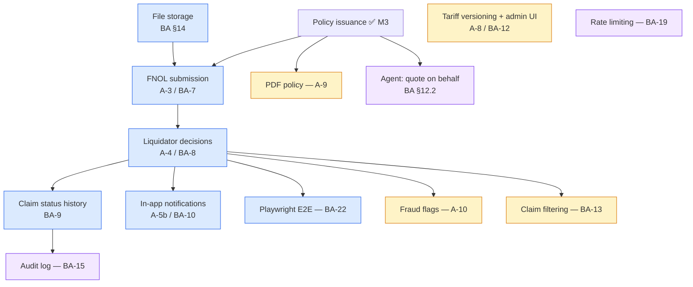

# Post-Milestone-3 Gap Analysis & Roadmap

## 0. Document Purpose

Milestone 3 is complete, merged, and tagged (`origin/main` at `a0f59e7`, tag `v3.0.0-milestone3`; Epics 6–9 all `done`). This document does three things:

1. **An intactness check** (§2) — an independent verification, against the merged tree rather than against the tracking files, that Milestone 3 actually shipped what it claims, and a reconciliation of the tracking drift that check uncovered.
2. **Traceability and gap analysis** (§3) — which of the original assignment's must-have requirements are still incomplete after three milestones.
3. **A roadmap** (§4–§5) — the remaining work as milestones ordered by business value and technical dependency, with **Milestone 4 detailed to implementation readiness** and Milestones 5–6 deliberately left at roadmap altitude.

It does not restate the Milestone 1, 2, or 3 PRDs; all three stay final and untouched. It continues their conventions: the `FR-M4-*` identifiers are globally unambiguous, the architecture decisions inherited from the three existing spines are binding and are not re-derived here, and epic numbering continues the project sequence — Epics 1–9 are complete, so **Milestone 4 is Epics 10–13**.

**Provenance rule** (unchanged from the Milestone 3 PRD). Nothing in §3 is invented. Every requirement carries a source tag:

- `[ASSIGNMENT]` — stated in `assignment.md`
- `[BA §n]` — stated in `docs/motor_insurance_portal_business_analysis.md` at that section
- `[M1-PRD]` / `[M2-PRD]` / `[M3-PRD]` — carried forward from a completed milestone's PRD, usually as an explicit out-of-scope item
- `[DEFERRED]` — logged in `deferred-work.md` or a retrospective action item
- `[NEW]` — a recommendation of this document, with its rationale stated inline

---

## 1. Where the Product Stands

**Working today, end to end.** A visitor registers as a CLIENT and logs in; a JWT carries their role and every protected endpoint checks it server-side. Three staff accounts are seeded by migration and each of the four roles lands on its own guarded route. A CLIENT fills in a quote form — driver age, region, engine cc, installments, and now **bonus-malus class** — and gets a persisted quote with a full premium breakdown priced from real, data-driven Bulgarian GO tariff tables. That quote carries a **14-day validity window** and a **derived status**, appears in a **My Quotes** list, and can be **accepted into a policy**: a unique `MI-{year}-{8 digits}` number, a 12-month coverage period, an immutable snapshot of holder, vehicle and pricing, and a **My Policies** list to find it in. Acceptance is genuinely idempotent — verified live with four concurrent requests producing exactly one policy. An expired token is no longer a session, a 401 ends the session cleanly, and an authenticated visitor is redirected away from the auth screens.

Every screen renders in Bulgarian or English with no untranslated fallback, is built from the Milestone 2 Tailwind design system, and is usable from ~375px up. The API is browsable as generated OpenAPI. The whole stack starts with one `docker compose up`; CI runs backend tests, frontend typecheck/test/build, an error-code contract check, and a Compose smoke test.

**Not built at all:** claims, notifications, tariff versioning, and every staff workflow beyond "you land on your own page". The backend has five modules (`auth`, `quote`, `pricing`, `policy`, `shared`) and nine migrations. There is no `claim`, `notification`, `customer`, `vehicle`, or `tariff` module — deliberately, per M1 AD-6 (modules are created by the story that first needs them).

The gap, stated plainly: **the assignment's headline deliverable is the `quote → policy → claim → decision` flow. Two of those four stages exist.** The Milestone 3 PRD wrote "one of those four"; that number is now two, and everything still missing sits in one connected chain.

---

## 2. Intactness Check

Requested explicitly: verify that Milestone 3 — including Epic 9, completed by a colleague — actually landed. Verified against `origin/main`, **reading the merged tree rather than trusting the tracking files**, because the tracking files turned out to be the thing that was wrong.

### 2.1 Finding 1 — the local checkout is stale (act on this first)

The working tree is on branch `feat/story-8-3-my-policies-list-and-detail`, **11 commits behind `origin/main`**. Its `sprint-status.yaml` still reads `epic-8: in-progress` and `epic-9: backlog`; its `deferred-work.md` predates the Epic 8 merge. **Any planning done against the working tree would be planning against pre-Epic-8 data.** Everything in this document was read from `origin/main`.

Related: `.claude/launch.json` is tracked on `origin/main` (the accidental commit in Story 8.3's PR, Epic 8 retro item 53, still undecided) while the local `.claude/` directory is untracked and now contains skill definitions. These will collide on sync. The undecided item should be decided before the branches are reconciled, not after.

### 2.2 Finding 2 — Milestone 3 is intact

All four epics `done`, all sixteen `FR-M3-*` traced to a shipped story. Verified in the merged tree, not inferred from the epic file:

| Deliverable | Verified artifact |
|---|---|
| `policy` module (M3 AD-1) | `policy/{api,application,domain,persistence}`; no `quote` import |
| Policy schema, sequence, unique constraint | `V9__create_policies_table.sql` |
| Bonus-malus as seeded tariff data (FR-M3-16, AD-8) | `V6__create_bonus_malus_class_table.sql`, `V7__add_bonus_malus_to_quotes.sql` |
| Quote lifecycle (FR-M3-02, 03) | `V8__add_quote_lifecycle_to_quotes.sql` |
| Session robustness (FR-M3-11…13) | `app/GuestGuard.tsx`, `api/sessionExpiry.ts`, `api/client.ts` |
| Policy screens (FR-M3-09, 10) | `features/policy/{MyPolicies,PolicyDetail,policyStatusPresentation}` |
| OpenAPI (FR-M3-14) | `shared/config/OpenApiConfig.java` + `OpenApiConfigTest.java` |
| Legacy CSS retirement (FR-M3-15) | `index.css` `@layer legacy` reduced to `box-sizing` + `body`; zero hex outside `@theme` |

Retro verdicts: **Epic 8 `accepted-with-open-items`**, **Epic 9 `accepted`**. Both retrospectives verified their core claims live against a real backend and database rather than only in tests — Epic 8's four-concurrent-accept run and Epic 9's `getComputedStyle` token check are the strongest evidence in the project so far. Epic 9's work is clean and complete.

### 2.3 Finding 3 — the tracker has drifted from the code

`sprint-status.yaml` on `origin/main` carries **31 `open` action items and 1 `in-progress`**. At least six are **already fixed in the code and were never reconciled**:

| Item | Claim | Actual state |
|---|---|---|
| 13 | `/login`+`/register` don't redirect an authenticated visitor | Fixed — `app/GuestGuard.tsx` (Story 7.2, FR-M3-13) |
| 14, 35 | `LoginForm` re-implements `decodeToken`+`isRole` inline | Fixed — `LoginForm.tsx:69` calls `getCurrentRole` |
| 36, 37, 38 | Legacy CSS survivors; Milestone 2's FR-1 unmet | Fixed — Story 9.2; Epic 9's retro states this outright |
| 46 | `formatDate.ts` lacks `timeZone: 'UTC'` | Fixed — PR #67; Epic 9's retro proposed `done`, nobody moved the key |

Genuinely still open, each confirmed by direct read: **39** (`Button` has no `loading` prop), **42** (`Spinner size="md"` — only its own test consumes it), **34/43** (`HealthStatus.tsx` still has **zero tests**; no `HealthStatus.test.tsx` exists), **45** (`QuoteControllerTest.java` still 644 lines, unsplit), **50–53** (`currentUserId` duplication, `policyIdFor` batch-for-single, `toView` per-row clock read, the `.claude/launch.json` decision), **54**, plus the older items 10, 12, 23–26, 29, 31–33, 41.

### 2.4 Finding 4 — the process item is now five retrospectives old

Epic 5 item 40 → Epic 6 item 47 → Epic 8 item 1 → Epic 9 item 1. Epic 8's retro landed a documentation-only fix (a `CONTRIBUTING.md` line plus a PR-template checkbox, PR #67); Epic 9's retro then demonstrated, with commit evidence, that **both PRs merged after that fix ignored it**. Finding 2.3 above is the same failure viewed from the other end: a fix lands, the tracker is never updated, and the next planner reads stale state.

This document treats it as a Milestone 4 deliverable (FR-M4-17), not as another retrospective note. The evidence now clearly favours automation over documentation — the alternative Epic 8's retro considered and declined.

---

## 3. Requirements Traceability — What Is Still Incomplete

### 3.1 Assignment must-haves (`assignment.md`, «Основен обхват»)

| ID | Requirement | State | Evidence | Where |
|---|---|---|---|---|
| A-1 | Quote engine — premium by parameters | ✅ | Zone × engine cc + age surcharge + **bonus-malus factor** + installment fee, all data-driven. Driving experience (стаж) remains a documented deliberate deviation (M1 addendum, D-1). | done (M3) |
| A-2 | Policy issuance from an accepted quote, unique number, coverage period | ✅ | `POST /quotes/{id}/accept`, `MI-2026-00000001`, 12-month inclusive period, immutable snapshot. | done (M3) |
| **A-3** | **FNOL — description, date, photos, processing status** | ❌ | No `claim` module, no file storage, no attachment handling anywhere in the stack. | **M4** |
| **A-4** | **Liquidator workflow — review, approve/reject, paid amount** | ❌ | `LiquidatorShell.tsx` is still a static "coming soon" placeholder. | **M4** |
| A-5a | Roles: client, agent, liquidator (+ administrator) | ✅ | `Role` enum, seeded staff, `@PreAuthorize`, `RoleGuard`. | done (M1/M2) |
| **A-5b** | **Notifications on status change** | ❌ | No `notification` module, no `notifications` table, no in-app UI. Depends entirely on A-3/A-4 existing. | **M4** |
| A-6 | Configurable tariff | ✅ | Six tariff tables, correctable without redeploy. | done |
| A-7 | README | ✅ | Root + `backend/` + `frontend/`; status section refreshed by Story 9.2. | done (M3) |
| A-8 | *Bonus* — tariff versions with time validity | ❌ | Tariff tables have no version and no validity window; quotes do not record which tariff priced them. | M5 |
| A-9 | *Bonus* — auto-generated PDF policy | ❌ | — | M5 |
| A-10 | *Bonus* — simple fraud flags by heuristic | ❌ | Depends on claims existing. | M5 |

**Three must-have requirements remain, and they form one chain.** Everything else in the assignment's must-have scope is delivered. `assignment.md`'s «Резултат» — «Портал с quote → полица → щета поток, интерфейс за ликвидатор, конфигурируема тарифа, README» — is satisfied in full at the end of Milestone 4.

### 3.2 Business-analysis must-haves still outstanding (BA §17)

| ID | Requirement | State | Where |
|---|---|---|---|
| BA-7 | FNOL form + photos `[BA §8.1, §14]` | ❌ | M4 |
| BA-8 | Liquidator workflow `[BA §8.3, §8.4]` | ❌ | M4 |
| BA-9 | Claim status history `[BA §8.4]` | ❌ | M4 |
| BA-10 | In-app notifications `[BA §9]` | ❌ | M4 |
| BA-14 | Optimistic locking on claim processing `[BA §19]` *(Should-have)* | ❌ | M4 — folded into the liquidator workflow; two liquidators on one claim is exactly the race BA §19 names |
| BA-22 | End-to-end Playwright scenario `[BA §16.5]` *(Should-have)* | ❌ | M4, last (D-7) |

BA-1…BA-6, BA-11, BA-16, BA-17, BA-20, BA-21 are all ✅. BA-2 (driver profile and vehicle) is satisfied minimally as a policy snapshot per D-2, not as first-class entities — that reading stands and is not reopened here. BA-12 (admin tariff UI), BA-13 (claim filtering), BA-15 (audit log) and BA-19 (rate limiting) are Should-haves scheduled in §4.

### 3.3 The dependency picture

**The critical path is a single chain:** file storage → FNOL → liquidator decisions → status history → notifications. Nothing outside Milestone 4 unblocks anything inside it. Tariff versioning, the PDF, fraud flags, claim filtering, the agent workflow and the audit log all hang off the side and can be sequenced freely once the chain is complete.

---

## 4. Proposed Roadmap

Milestones are named for the user-visible capability they deliver.

| # | Name | The user can… | Closes | Altitude here |
|---|---|---|---|---|
| **M4** | **File a claim and get a decision** | File an FNOL with photos against their own policy, track its status, and be notified as a liquidator moves it through review → approved/rejected → paid | **A-3, A-4, A-5b**, BA-7…BA-10, BA-14, BA-22 | **Detailed (§5)** |
| **M5** | **The bonus goals** | See which tariff version priced their quote; download a PDF policy; liquidators see fraud flags with reasons and can filter their queue | A-8, A-9, A-10, BA-12, BA-13 | Roadmap only |
| **M6** | **Staff depth and hardening** | Agents quote and issue on behalf of a client they look up; every decision is auditable; the deferred backlog is paid down | BA §12.2, BA-15, BA-19, `deferred-work.md` | Roadmap only |

### 4.1 Ordering rationale

**M4 first, and it is the last must-have milestone.** It is the only remaining work named in `assignment.md`'s must-have list, it is a hard dependency of three of the four items in M5, and it converts the liquidator shell — the one staff workflow the assignment names outright — from a placeholder into a real workspace. At the end of M4 the assignment's «Резултат» is complete.

**M5 = the assignment's own bonus goals** (D-6, approved 2026-09-01). This **reorders the Milestone 3 PRD's roadmap**, which had M5 as staff workflows and M6 as paperwork. The reason: A-8, A-9 and A-10 are named in `assignment.md` as bonus goals and therefore carry grading credit, whereas the agent workflow and the audit log are business-analysis additions the assignment never asks for. With the must-have list closed, assignment-named bonus items outrank BA-only depth. BA-12 (admin tariff UI) joins M5 because it is the natural surface for A-8's versioning, and BA-13 (claim filtering) joins it because it is cheap once claims exist.

**M6 = everything left.** The agent workflow leads it, but note that BA §4 itself flags the role as under-defined («Ролята агент не е подробно дефинирана в условието»); the Milestone 3 PRD's Q-5 fixed a working definition — creates quotes and issues policies on behalf of a client they look up, cannot decide claims, cannot manage tariffs — and that definition should be re-confirmed with the mentor before M6 is detailed. Also here: the audit log, rate limiting, and the ~80-entry `deferred-work.md` backlog.

**No further visual milestone.** Milestone 2 built the design system; every M4 and M5 screen consumes it rather than reinventing it. That remains Milestone 2's return on investment.

### 4.2 M5 and M6 stay one paragraph each on purpose

Their shape depends on what Milestone 4 teaches. Two things are worth recording now so they are not rediscovered late:

- **A-8 is a bigger change than it reads.** Tariff versioning touches the pricing tables, adds a validity window and a lifecycle to each, and requires quotes to record *which* version priced them. Policies are already safe — M3 AD-4 makes them copy rather than reference — so the historical-correctness risk is confined to quotes.
- **A-10 (fraud flags) is heuristic, not a model.** BA §18.2 scopes it as simple rules over claim data. It should stay that, and any flag surfaced to a liquidator must read as a prompt to look, never as a determination.

---

## 5. Milestone 4 — File a Claim and Get a Decision *(detailed)*

### 5.1 Vision

Today a client can be told what insurance costs, and can buy it. Then nothing happens. A policy is a receipt, not a relationship.

Milestone 4 closes the second half of the assignment's headline flow: a policy becomes something you can **claim against**, and the liquidator — the one staff role the assignment names outright — becomes someone who actually **decides**. When this milestone ships, the mentor demo becomes the whole thing: *register → quote → accept → policy → file a claim with photos → liquidator reviews and approves → client is notified and sees the paid amount.* That is `assignment.md`'s «Резултат», complete.

It is also the milestone with the largest new security surface in the project. Until now the system has accepted numbers and short strings. It is about to start accepting **files**, and serving them back. That is treated as a first-class requirement (§5.4.1), not as plumbing.

### 5.2 Key User Journeys

- **UJ-6. Elena files a claim after a parking-lot scrape.**
  - **Persona + context:** Elena (M1 UJ-1, M3 UJ-4) holds policy `MI-2026-00000001`. Someone hit her bumper three days ago.
  - **Entry state:** Logged in as CLIENT, on My Policies.
  - **Path:** Opens the policy → "File a claim" → enters the incident date, a description of what happened, and the location → attaches three photos from her phone → submits.
  - **Climax:** The claim is accepted with its own number, `CL-2026-00000001`, and a status of `SUBMITTED`.
  - **Resolution:** It appears under "My claims" and she can open it to see everything she submitted, including her photos.
  - **Edge case A:** She attaches a PDF renamed to `.jpg`. It is rejected on the real content type, not the extension, with a specific translated message.
  - **Edge case B:** She enters an incident date after her coverage ended — but *within* the period the policy covered. It is accepted, because coverage on the incident date is what matters, not whether the policy is active today.
  - **Edge case C:** She enters a date in the future. Rejected with a field-level message.

- **UJ-7. Toma the liquidator works his queue.**
  - **Persona + context:** Toma has been a placeholder since Milestone 1. This is the milestone he gets a job.
  - **Entry state:** Logged in as LIQUIDATOR, landing on his workspace — now a real queue rather than a "coming soon" card.
  - **Path:** Sees claims across all clients, newest first, with status and incident date → opens Elena's → reads the description and views the photos full-size → starts the review → approves it with an amount of 340.00 EUR.
  - **Climax:** The claim moves `SUBMITTED → UNDER_REVIEW → APPROVED`, each step recorded in its history with who did it and when.
  - **Resolution:** Later he marks it `PAID`. Elena is notified at every step.
  - **Edge case A:** He tries to reject without a reason, or approve with a zero amount. Both refused.
  - **Edge case B:** A second liquidator opened the same claim a minute earlier and already approved it. Toma's action is refused with a clear "this claim changed while you were working on it" message — not a silent overwrite of his colleague's decision.
  - **Edge case C:** He tries to jump `SUBMITTED → PAID`. The backend refuses; the operation is not even offered in the UI.

- **UJ-8. Elena finds out without asking.**
  - **Persona + context:** Elena has no idea Toma exists.
  - **Entry state:** She logs in two days after filing.
  - **Path:** Her navigation shows unread notifications.
  - **Climax:** "Your claim CL-2026-00000001 has been approved for 340.00 EUR."
  - **Resolution:** She opens the claim, sees the full status history, and marks the notification read. It does not reappear on her next login — the notification is a database row, not a toast that vanished while she was away.

### 5.3 Glossary (deltas only)

- **Claim** — a client's report of an incident against one of their own policies: incident date, description, location, photos, a status, and a decision.
- **Claim number** — a globally unique, human-readable identifier in `CL-{year}-{8 digits}` form, sequence-allocated. Deliberately mirrors the policy-number rule (M3 AD-7).
- **FNOL** — First Notice Of Loss: the claim as first submitted, before any liquidator has touched it.
- **Attachment** — one uploaded photo: bytes on a storage volume, metadata (storage key, content type, size, hash, upload time) in Postgres. Never bytes in Postgres (BA §14).
- **Storage key** — the randomly generated name a stored file is written under. Never the client-supplied filename, which is retained only for display.
- **Claim status** — `SUBMITTED` → `UNDER_REVIEW` → `APPROVED` | `REJECTED` → `PAID` (BA §8.3, MVP set). Backend-controlled; never chosen by the caller.
- **Business operation** — a named, intent-carrying endpoint (`start-review`, `approve`, `reject`, `mark-paid`) that encodes one legal transition and its preconditions. Explicitly not a generic "set the status to X" endpoint (BA §8.4).
- **Claim status history** — an append-only record of every transition: from, to, who, when, and the reason or amount that accompanied it.
- **Notification** — a persisted, per-recipient record of something that happened, with a read/unread state. Not a transient UI toast (BA §9).

### 5.4 Features

#### 5.4.1 Attachments a system can trust

**Description:** The first time this product accepts a file from a user and serves it back. Every check below is named in BA §14 and is release-blocking, not hardening: a photo-upload endpoint without them is the most exploitable surface in the codebase. Realizes UJ-6.

**FR-M4-01 — Validated photo upload** `[ASSIGNMENT]` `[BA §14]`

A CLIENT can attach photos to a claim they are filing, and every uploaded file is validated before it is stored.

*Consequences (each independently testable):*
- Only JPEG, PNG and WebP are accepted, determined by **sniffing the actual content**, not by the filename extension or the client-supplied `Content-Type` header. A PDF renamed `.jpg` is rejected.
- A per-file size cap and a per-claim file-count cap are enforced, both configured in one place rather than at a call site.
- Each stored file is written under a **randomly generated storage key**; the client-supplied filename is stored as display metadata only and never used to build a path.
- No client-supplied string reaches the filesystem path. Traversal sequences and executable extensions cannot be expressed in a storage key by construction.
- A rejected file produces a specific, translated, field-level error — never a generic 500.

**FR-M4-02 — Permission-checked download** `[BA §14]` `[BA-20]`

Stored photos are reachable only through an authenticated endpoint that checks who is asking.

*Consequences (testable):*
- The claim's own CLIENT owner and any LIQUIDATOR can fetch it; anyone else gets **404, never 403** — preserving M3 AD-10's rule that a resource you may not see is indistinguishable from one that does not exist.
- Knowing or guessing a storage key grants nothing; the storage volume is not statically served.

**FR-M4-03 — Bytes on a volume, metadata in Postgres** `[BA §14]`

Image bytes live on a storage volume behind a `Storage` interface; Postgres holds only `storageKey`, content type, size, hash and upload time.

*Notes:* Local directory plus a Docker volume, not MinIO — see **D-9**. The interface exists so an S3-compatible backend is a later substitution rather than a rewrite; it is not built now.

#### 5.4.2 Filing a claim

**Description:** The client half of the assignment's «завеждане на щета». Realizes UJ-6.

**FR-M4-04 — File an FNOL against your own policy** `[ASSIGNMENT]` `[BA §8.1]`

A CLIENT selects one of their own policies, enters the incident date, a description and a location, attaches photos, and receives a claim with a unique number.

*Consequences (testable):*
- The policy list offered is owner-scoped in the query; a policy that is not yours cannot be selected, and submitting its id directly yields 404.
- A CLIENT may file more than one claim against the same policy — no uniqueness constraint (**D-9**).
- The claim's initial status is `SUBMITTED`, set by the backend, never accepted from the caller.

**FR-M4-05 — Coverage is validated on the incident date** `[BA §8.2]`

The check is whether the policy covered the incident **on the day it happened**, not whether the policy is active now.

*Consequences (testable):*
- A claim against an `EXPIRED` policy for an incident inside its coverage window is **accepted**.
- A claim for an incident before `coverage_start` or after `coverage_end` is rejected with a distinct, translated error code.
- Boundaries are inclusive at both ends, consistent with M3 AD-6. An incident on `coverage_end` is covered.
- The comparison uses the injected clock in the business zone (M3 AD-6); no production code reads `LocalDate.now()` directly.

**FR-M4-06 — Input validation on the FNOL** `[BA §8.2]`

*Consequences (testable):*
- An incident date in the future is rejected with a field-level, translated error.
- The description has an enforced minimum and maximum length; both are field-level errors, not a generic failure.

**FR-M4-07 — Unique claim number** `[ASSIGNMENT]` `[BA §7.4 pattern]`

Every claim carries a unique, human-readable number in `CL-{year}-{8 digits}` form.

*Consequences (testable):*
- Allocated from a dedicated PostgreSQL sequence with a `UNIQUE` constraint as the backstop. No code path reads the highest existing number and increments it.
- The sequence is global and does not reset per year, mirroring M3 AD-7 exactly. Gaps are expected and acceptable.

**FR-M4-08 — My claims** `[BA §12.1]`

A CLIENT can list their own claims and open one to see everything submitted, its current status, its full status history, and its photos.

*Consequences (testable):*
- Owner-scoped in the query (M3 AD-10). A second client's claims never appear under any query parameter.
- An empty list renders as a deliberate empty state, not an error.

#### 5.4.3 The liquidator decides

**Description:** The staff half of the assignment's «работен поток за ликвидатор: преглед, одобрение/отказ, изплатена сума», implemented to BA §8.4's transition rules. This is the first real staff workspace in the product. Realizes UJ-7.

**FR-M4-09 — Backend-enforced status lifecycle** `[ASSIGNMENT]` `[BA §8.3, §8.4]`

`SUBMITTED` → `UNDER_REVIEW` → `APPROVED` | `REJECTED` → `PAID`, with transitions enforced by the backend.

*Consequences (each independently testable):*
- Only `SUBMITTED` may become `UNDER_REVIEW`; only `UNDER_REVIEW` may be approved or rejected; only `APPROVED` may become `PAID`.
- `REJECTED` and `PAID` are terminal — no operation moves a claim out of either.
- A direct `SUBMITTED → PAID` attempt is refused with a distinct error code, and the operation is not offered in the UI.
- The legal-transition rule is implemented **once**, in the domain layer, and every path uses it — the same discipline M3 AD-3 applies to derived status.
- `NEEDS_MORE_INFORMATION` and `WITHDRAWN` are out of scope (§5.7); they do not appear in the enum without a producer.

**FR-M4-10 — Business operations, not a status setter** `[BA §8.4]`

Transitions are exposed as `POST /api/v1/claims/{id}/start-review`, `/approve`, `/reject`, `/mark-paid`.

*Consequences (testable):*
- No endpoint anywhere accepts a caller-supplied claim status.
- Each operation carries `@PreAuthorize("hasRole('LIQUIDATOR')")`; a CLIENT calling one gets 403 (role mismatch — distinct from the 404 an ownership miss produces, per M3 AD-10).

**FR-M4-11 — A decision carries its justification** `[ASSIGNMENT]` `[BA §8.4]`

*Consequences (testable):*
- Rejection requires a reason; an empty or whitespace-only reason is a field-level validation error.
- Approval requires a **strictly positive** approved amount. Zero and negative are rejected.
- The approved amount carries **at most 2 decimal places**; a third is a field-level validation error, not a silent rounding.
- The approved amount is `BigDecimal` / `NUMERIC`, HALF_UP to 2 decimals (M1 AD-5), consistent with every other monetary value in the system.
- The only upper bound is **technical**: the column's own `NUMERIC(p,s)` precision. A value that does not fit is a validation error with a distinct code, never a database exception surfacing as a 500.
- The reason and the amount are stored on the transition that carried them, not only as the claim's current state.

*Notes (D-10, resolved 2026-09-01):* **No business limit of liability is modelled**, and none is invented here. The approved amount is deliberately **not** bounded by the policy premium — an indemnity has no arithmetic relationship to what was paid for the cover, and tying the two would encode a rule no requirement source states. The README and the OpenAPI description must both say plainly that a limit of liability is not modelled in this system and could be added later as separate configuration (a per-policy or per-tariff sum insured), the same way the bonus-malus provenance note is carried.

**FR-M4-12 — The liquidator queue** `[ASSIGNMENT]` `[BA §12.3]`

A LIQUIDATOR sees claims across all clients, newest first, with number, status, incident date and policy; opening one shows the full submission including full-size photos.

*Consequences (testable):*
- Unlike every client-facing list in the product, this one is deliberately **not** owner-scoped — the liquidator's job requires seeing other people's claims. That inversion of M3 AD-10 is a role-gated exception and is stated as such in the architecture, so no reviewer reads it as a leak.
- Filtering by status, date or client is **not** in this milestone (BA-13, M5). The queue is ordered, unpaginated and unfiltered, consistent with M3 AD-12.

**FR-M4-13 — Concurrent decisions do not silently overwrite** `[BA-14]` `[BA §19]`

Two liquidators acting on the same claim: the first wins, the second is told.

*Consequences (testable):*
- Enforced by optimistic locking on the claim, not by application-level checking alone — the same "the database is the authority" discipline M3 AD-5 applies to policy issuance.
- The loser receives a distinct, translated conflict error explaining that the claim changed, never a generic 500 and never a silent success.
- Covered by a Testcontainers integration test with genuinely concurrent transitions, matching the standard Epic 8 set for the accept transaction.

**FR-M4-14 — Every transition is recorded** `[BA §8.4]` `[BA-9]`

*Consequences (testable):*
- Each transition appends a row: from-status, to-status, actor, timestamp, and the reason or amount that accompanied it.
- The history is append-only — no path updates or deletes a history row.
- It is visible to the claim's owner and to liquidators, so a client can see what happened and when, not merely where the claim ended up.

#### 5.4.4 Told what happened

**Description:** The assignment's «известия при смяна на статус». BA §9 is explicit that these must be database rows, not React toasts — a notification the user was not looking at when it fired must still be there tomorrow. Realizes UJ-8.

**FR-M4-15 — A status change produces a notification** `[ASSIGNMENT]` `[BA §9]` `[BA-10]`

*Consequences (testable):*
- The `claim` module publishes a `ClaimStatusChanged` **Spring application event**; the `notification` module consumes it and persists a row. No message broker (BA §9 says outright that Kafka and RabbitMQ are unnecessary).
- The two modules do not import each other's types; the event is the contract. This preserves M1 AD-2 and mirrors M3 AD-1's one-directional `quote → policy` dependency.
- A notification exists for every transition a client should know about: submitted, review started, approved, rejected, paid.
- Notification delivery never fails the transition that caused it — a claim decision is not rolled back because a notification row could not be written.

**FR-M4-16 — Unread notifications in the client's workspace** `[BA §9]` `[BA §12.1]`

*Consequences (testable):*
- A CLIENT sees their unread count and can open the list; each entry links to the claim it concerns.
- Marking read persists — it survives a logout, and the same notification does not reappear on the next login.
- Owner-scoped in the query (M3 AD-10); a client never sees another client's notifications.
- The frontend polls; no Server-Sent Events or WebSocket (BA §9 lists both as future work).

#### 5.4.5 Supporting work *(should-have)*

**FR-M4-17 — The tracker stops lying** `[DEFERRED: Epic 9 retro item 1, Epic 8 item 1, Epic 6 item 47, Epic 5 item 40]`

Two parts, both cheap:

- **Reconcile now.** Close the six action items §2.3 shows are already fixed in code (13, 14, 35, 36, 37, 38, 46). This is a data fix to `sprint-status.yaml`, not a code change, and should land **before** Milestone 4's first story so the milestone starts from true state.
- **Automate**, on a two-tier rule (**D-11**, resolved 2026-09-01). The check distinguishes what it can verify objectively from what it can only guess at:

  **Tier 1 — blocking.** Objective structural facts about the tracker itself, none of which depend on knowing where a PR sits in its merge lifecycle:
  - `sprint-status.yaml` does not parse as valid YAML.
  - A story key is duplicated.
  - A story exists in the epics file but has no key in the tracker, or vice versa.
  - The epics file, a `spec-*.md`, and the tracker disagree about which stories an epic contains.

  **Tier 2 — warn only.** Anything that depends on merge lifecycle — most obviously "this PR's branch name implies story X but the diff does not move X's key to `done`." A PR can legitimately touch a story's files without closing it, and a false red build teaches people to ignore the check, which is exactly how the `CONTRIBUTING.md` line died.

  *Consequences (testable):* a PR introducing invalid YAML or a duplicate key fails CI. A chore or fix PR that closes no story passes without a warning. A story PR that forgets its own key warns but does not block.

  *Note:* if the two tiers prove impractical to implement separately and the choice collapses to one behaviour, **choose fail** (product owner, 2026-09-01). A blocking check that occasionally annoys is strictly better than an advisory one that is ignored — which is the outcome already observed twice.

**FR-M4-18 — Fold in the carry-forward items this milestone would otherwise worsen** `[DEFERRED: Epic 8 items 50–52]`

Applying Epic 5 retro item 41's own lesson — enumerate the open items sitting in the files a milestone will touch, and decide per file rather than adding a fourth verbatim copy:

- **Item 50** (`currentUserId(Authentication)` duplicated between `QuoteController` and `PolicyController`) is **promoted from deferred to in-scope**, because `ClaimController` and `NotificationController` are about to become the third and fourth copies. Extract it once, first.
- **Items 51 and 52** (`QuoteService.policyIdFor` routing a single lookup through the batch method; `PolicyService.toView` re-reading the clock per row) are one-line fixes in files this milestone reads. Take them opportunistically.
- **Item 45** (`QuoteControllerTest.java`, 644 lines, unsplit) stays open. Milestone 4 adds no quote endpoints, so its risk does not recur.

**FR-M4-19 — The demo runs itself** `[BA §16.5]` `[BA-22]` `[D-7]`

A Playwright end-to-end scenario covering BA §16.5's seven steps: log in → create a quote → accept it → receive a policy → file a claim → liquidator approves → client sees the status and the notification.

*Notes:* **Should-have, sequenced last** (D-7). The demonstrable flow is delivered by the application; this automates the demo rather than creating it. It is the first thing to yield if time runs short — and the last thing to cut before anything must-have is touched.

#### 5.4.6 Module boundaries, enforced by a test

**FR-M4-20 — A minimal ArchUnit guard on module dependencies** `[DEFERRED: deferred-work.md, Story 8.1 review]` `[D-12]`

Milestone 4 takes the backend from five modules to seven and adds a second one-directional dependency rule. Both existing rules are enforced today by Javadoc and reviewer attention alone, which is how M3 AD-1's own retrospective described the risk. A test-only guard replaces convention with a failing build.

*Consequences (testable):*
- **No dependency cycles between modules.** Any cycle fails the test.
- **Only the one-directional rules the architecture has already accepted are asserted**, each by name: `policy` must not depend on `quote` (M3 AD-1); `notification` must not depend on `claim` (FR-M4-15); cross-module access is through the target's `application` package only (M1 AD-2).
- The guard lives entirely in `src/test/java`. No production code, no build plugin, no new runtime dependency.

*Scope constraint (binding, product owner, 2026-09-01, D-12):* this is a **minimal test-only guard, not an architecture programme.** Spring Modulith is explicitly out of scope, as is any refactor undertaken to satisfy the tool rather than the rules. If a rule the architecture never stated turns out to be violated, the finding is logged to `deferred-work.md` and the assertion is not added — the guard encodes decisions already taken, it does not make new ones.

*Sequencing:* lands in **Epic 12, alongside story 12.1**, which is the point at which every Milestone 4 module exists and the full rule set is knowable. **Deliberately not placed in Epic 13** — it guards must-have work, and nothing protecting the must-have chain sits behind a should-have epic (D-5).

### 5.5 Cross-cutting requirements for this milestone

All inherited and binding; none re-derived here.

- **Ownership (M3 AD-10):** every client-facing read is owner-scoped **in the query itself**, following `findByIdAndCustomerId`. No path fetches by id and then checks ownership in Java. A miss is 404, never 403. **The single deliberate exception is FR-M4-12**, the liquidator queue, which is role-gated instead — stated explicitly so it reads as a decision.
- **Money (M1 AD-5):** the approved amount is `BigDecimal` / `NUMERIC`, HALF_UP to 2 decimals. No floating point anywhere near it.
- **Time (M3 AD-6):** `Europe/Sofia`, injectable `Clock`, `LocalDate` for business dates and `Instant` for event timestamps, boundaries inclusive at both ends. The incident-date coverage check (FR-M4-05) is the place this matters most.
- **Error contract (M1 AD-7, M3 AD-11):** new codes namespaced `CLAIM_*`, `ATTACHMENT_*`, `NOTIFICATION_*`, each shipping with its `bg` and `en` translation in the same change. CI's existing error-code contract check is the gate.
- **i18n (M1 AD-8):** every new screen and message in both languages, no untranslated fallback. The backend emits codes, never prose.
- **Design system (M2):** every new screen — the FNOL form, My Claims, the liquidator queue, the claim detail, the notification list — is built from the Milestone 2 component library and usable from ~375px up. No new one-off styling.
- **Module boundaries (M1 AD-2, AD-6):** `claim` and `notification` are created by the stories that first need them. `claim` reaches `policy` only through `policy.application`. `notification` never imports a `claim` type — the application event is the contract.
- **Testing (BA §16.3, §16.4):** Testcontainers integration tests for the transition rules and for the concurrent-decision race. BA §16.3's own list is the acceptance checklist: incident outside coverage rejected, future date rejected, a client cannot see another's claim, no direct `SUBMITTED → PAID`, rejection requires a reason, approval requires an amount, an invalid file is rejected, concurrent changes are detected.
- **Process:** a story's `sprint-status.yaml` key moves to `done` in the PR that closes it — now with the enforcement FR-M4-17 adds, since the documented version demonstrably did not hold.

### 5.6 Epic breakdown

Four epics, eleven stories, continuing the project sequence.

**Epic 10 — File a claim with photos** *(FR-M4-01…08)*
- 10.1 Attachment storage and validated upload (backend)
- 10.2 Claim submission, coverage-on-incident-date check, claim number (backend)
- 10.3 The FNOL form (frontend)
- 10.4 My Claims — list and detail with photos (frontend)

**Epic 11 — The liquidator decides** *(FR-M4-09…14)*
- 11.1 Transition rules, status history and optimistic locking (backend)
- 11.2 The liquidator queue and claim detail (frontend)
- 11.3 The four decision actions (frontend)

**Epic 12 — Told what happened** *(FR-M4-15…16, FR-M4-20)*
- 12.1 `notification` module, the `ClaimStatusChanged` event, and the ArchUnit module-boundary guard (backend)
- 12.2 In-app notifications (frontend)

**Epic 13 — The demo runs itself** *(FR-M4-17…19, should-have)*
- 13.1 Sprint-status CI enforcement and the remaining carry-forward fixes
- 13.2 Playwright end-to-end scenario

**Epics 10–12 are the must-have chain. Epic 13 must never block them** (D-5, reaffirmed 2026-09-01). If time runs short, Epic 13 yields whole — and within it, FR-M4-19 (Playwright) yields before FR-M4-17 (the CI check). Nothing in Epics 10–12 waits on anything in Epic 13.

**Sequencing note.** Two items are deliberately pulled out of Epic 13 and run *before* Epic 10, because both are cheap and both get more expensive if deferred:
- **FR-M4-18's `currentUserId` extraction** belongs at the front of Epic 10 — that is where the third copy would otherwise be written.
- **FR-M4-17's reconciliation half** (closing the six already-fixed action items) is a data fix, not a code change, and should land before the first story so the milestone starts from true state.

Only the CI automation and the Playwright work genuinely sit at the end. FR-M4-20's guard sits in Epic 12, not Epic 13, for the reason §5.4.6 gives.

### 5.7 Non-goals for Milestone 4

- **Third-party FNOL filing.** The filer is always the authenticated policyholder, per the Milestone 3 PRD's binding scope constraint (Q-4, BA §8.1: «Клиентът: избира своя полица»). The realistic Bulgarian GO path — the injured party filing with their own bank details, `docs/questions.md` #13 — is out of scope. **This project must not be described, anywhere, as a full implementation of the legal motor third-party-liability claims process.** It implements the policyholder's own claim journey against their own policy, and says so plainly wherever the claims feature is documented.
- **`NEEDS_MORE_INFORMATION` and `WITHDRAWN`** — BA §8.3 lists both as optional. Not built; not added to the enum without a producer, consistent with how M3 handled `CANCELLED`.
- **Claim filtering** by status, date or client (BA-13) — Milestone 5.
- **Payment execution.** `mark-paid` records that payment happened; it does not move money, generate an invoice, or integrate anything.
- **Fraud flags** (A-10) — Milestone 5.
- **PDF documents** of any kind (A-9) — Milestone 5.
- **Email, SMS, push, SSE or WebSocket notifications** — BA §9 future work. In-app polling only.
- **Agent and administrator workflows.** Their shells stay placeholders until Milestone 6, and the agent definition is re-confirmed with the mentor before then (Q-5).
- **`CustomerProfile` and `Vehicle` as first-class entities** — D-2 stands; identity remains a policy snapshot.
- **Tariff versioning or an admin tariff UI** — Milestone 5.
- **Auth hardening** beyond what M3 shipped — no refresh tokens, no rate limiting, no lockout, no revocation. Unchanged non-goal since Milestone 1. See D-8 and Q-2's recorded trigger.
- **Accessibility beyond the semantic-HTML floor** — Q-3 stands. The Milestone 2 component library renders semantic HTML and new screens inherit that for free; nothing further is planned. A decision not to invest further, not a licence to regress.
- **A new visual pass.** New screens consume the existing design system.

### 5.8 Success metrics

**Primary**
- **SM-1:** BA §16.5's full seven-step chain — log in → quote → accept → policy → file a claim with photos → liquidator approves → client sees the status and the notification — completes live in front of the mentor with no manual database intervention. Validates FR-M4-01…16. **This is the assignment's «Резултат», demonstrated.**
- **SM-2:** two liquidators acting concurrently on one claim produce one decision and one clear conflict, demonstrable on a live database. Validates FR-M4-13. *(The Epic 8 retrospective set the standard for this kind of proof — a live concurrent run, not only a Testcontainers test. Match it.)*

**Secondary**
- **SM-3:** a file that is not genuinely a JPEG, PNG or WebP is rejected regardless of its extension or declared content type, and a stored photo is unreachable without an authorized session. Validates FR-M4-01, FR-M4-02.
- **SM-4:** a claim for an incident inside an expired policy's coverage window is accepted; one outside it is refused with a specific translated explanation. Validates FR-M4-05.
- **SM-5:** every screen added this milestone renders correctly in both languages at 375px, with no untranslated key and no horizontal scroll. Validates the §5.5 cross-cutting requirements.

**Counter-metrics (do not optimize)**
- **SM-C1:** time spent on claim-adjacent nice-to-haves — filtering, dashboards, richer photo galleries, extra statuses. Milestone 4 is the last must-have milestone; every hour spent past its scope is an hour not spent on the assignment's three bonus goals, which are the only graded work left after it. Counterbalances SM-1.
- **SM-C2:** time spent on the Playwright harness (FR-M4-19) before the three must-have epics are complete. It is the milestone's designated yield-first item; treating it as foundational inverts the priority. Counterbalances SM-1.

---

## 6. Decisions — Resolved 2026-09-01

**D-5 — APPROVED: Milestone 4 stays one milestone, four epics.** Filing and deciding ship together. A claim nobody can decide on has no demo value and no user value, and A-5b (notifications) is an assignment must-have, so it cannot be the item that slips. Epic 13 is the designated yield-first should-have. *Rejected alternatives: splitting filing from deciding across two milestones (ends on a claim stuck in `SUBMITTED` — a weaker mentor checkpoint, and it delays assignment-complete); dropping Epic 13 (leaves the five-retrospective-old tracker problem unfixed).*

**D-6 — APPROVED: reorder Milestone 5 and 6 relative to the Milestone 3 PRD.** M5 becomes the assignment's own bonus goals (A-8 tariff versioning with BA-12's admin UI as its surface, A-9 PDF policy, A-10 fraud flags, plus BA-13 claim filtering); M6 becomes staff depth and hardening (BA §12.2 agent workflow, BA-15 audit log, BA-19 rate limiting, the deferred backlog). Rationale: with the must-have list closed at the end of M4, requirements named in `assignment.md` carry grading credit that business-analysis-only additions do not. *This supersedes the Milestone 3 PRD's §3 roadmap table for M5 and M6 only; that PRD stays final and unmodified, and its M4 row is unchanged.*

**D-7 — APPROVED: the Playwright end-to-end scenario is should-have, sequenced last.** The demonstrable end-to-end flow is delivered by the application itself; Playwright automates the demo rather than creating it. It stays in Epic 13 as the first item to yield under time pressure — and the last to cut before anything must-have is touched.

**D-8 — APPROVED: deployment stays local-only.** Q-2's recorded trigger stays unfired: the ungated `V5` staff seed, the JWT-secret fail-fast guard, rate limiting (BA-19) and nginx security headers remain deferred. **The trigger itself remains live and is restated here so it is not lost across another milestone boundary: all four become release-blocking the moment a public deployment is on the table.**

**D-9 — Taken by the facilitator, flagged rather than escalated.** Two calls that did not warrant the product owner's time, recorded so they are visible rather than buried:
- **Storage backend: a local directory behind a `Storage` interface plus a Docker volume — not MinIO.** BA §14 permits either. MinIO costs a container and an SDK for zero assignment credit; the interface keeps the S3-compatible door open as a substitution rather than a rewrite. Reverse this only if the mentor's answer to `docs/questions.md` #3 asks for it.
- **Multiple claims per policy are allowed**, with no uniqueness constraint. BA does not forbid it and real motor liability insurance does not either.

**D-10 — APPROVED (resolves Q-6): no invented limit of liability.** `approvedAmount > 0`, at most 2 decimal places, upper bound technical only (the column's `NUMERIC` precision), surfaced as a validation error rather than a database exception. The indemnity is **not** bounded by the premium. The absence of a modelled limit is documented in the README and the OpenAPI description as something that could later be added as separate configuration. → FR-M4-11.

**D-11 — APPROVED (resolves Q-7): the sprint-status CI check is two-tier.** Blocks on objective structural inconsistencies — invalid YAML, duplicated or missing story keys, disagreement between the epics file, the specs and the tracker. Warns only on merge-lifecycle-dependent checks. If the tiers cannot be separated in implementation, the check fails rather than warns. → FR-M4-17.

**D-12 — APPROVED (resolves Q-9): a minimal, test-only ArchUnit guard.** No cycles between modules, plus only the one-directional rules the architecture has already accepted. Spring Modulith and any architecture-wide refactor are explicitly out of scope. Lands in Epic 12, not Epic 13, because it guards must-have work. → FR-M4-20.

**D-13 — APPROVED and executed (resolves Q-8): `.claude/` is local developer configuration.** Archived first, branch synced second, then a separate small change widening the ignore rule and untracking `.claude/launch.json` without deleting anything on disk. Closes `epic-8-retro-item-53`.

**D-5 addendum — Epic 13 is non-blocking, restated as a constraint.** Reaffirmed 2026-09-01: Epics 10–12 are the must-have chain and nothing in them may wait on Epic 13. Within Epic 13, FR-M4-19 (Playwright) yields before FR-M4-17 (the CI check). This is why FR-M4-20's module guard sits in Epic 12 and why FR-M4-18's helper extraction and FR-M4-17's reconciliation half run ahead of Epic 10.

---

## 7. Questions — Resolved 2026-09-01

All four were raised in this document's draft and answered by the product owner the same day. Recorded with their reasoning so a later reader sees why, not just what.

**Q-6 — There is no sum insured anywhere in the data model. RESOLVED.** `[NEW]` BA §8.4 requires that approval carry a positive amount but names no upper bound, and nothing in the schema — not the quote, not the tariff, not the policy — records a coverage limit. **Resolution: do not invent a business limit, and do not bound the indemnity by the premium.** Require `approvedAmount > 0`, at most 2 decimal places, with the only ceiling being the column's own `NUMERIC` precision, enforced as a validation error rather than a database exception. Document in the README and the OpenAPI description that a limit of liability is not modelled and can be added later as separate configuration. → **D-10**, FR-M4-11.

*Why not a cap:* inventing a sum insured would mean inventing a concept neither requirement source defines — the same discipline D-1 applied when it declined to invent bonus-malus coefficients. Tying the payout to the premium would be worse than arbitrary: an indemnity has no arithmetic relationship to the price of the cover, so that rule would be actively wrong rather than merely unstated.

**Q-7 — Should the sprint-status enforcement fail a PR, or only warn? RESOLVED, two-tier.** `[DEFERRED: Epic 9 retro, open question]` **Resolution: block on objective structural inconsistencies** — invalid YAML, duplicated or missing story keys, and disagreement between the epics file, the specs and the tracker. **Warn only on checks that depend on merge lifecycle**, where a false positive is plausible. **If the two tiers cannot be separated in practice, choose fail.** → **D-11**, FR-M4-17.

*Why this split:* it is exactly the boundary between what CI can verify and what it can only infer. Every Tier 1 condition is a fact about the file; every Tier 2 condition is a guess about intent. The doc-only fix died because it was purely advisory, so where the evidence is objective the check earns the right to block.

**Q-8 — Should `.claude/` be gitignored before the branches are reconciled? RESOLVED: yes, and already done.** `[DEFERRED: Epic 8 retro item 53]` **Resolution: treat `.claude/` as local developer configuration.** Executed 2026-09-01, in this order: the local directory was archived (250 files) before anything was touched; the working branch was synced to `origin/dev`; and a separate, deliberately small change — branch `chore/untrack-claude-local-config` — widens the `.gitignore` rule from `.claude/skills/` to `.claude/` and untracks `.claude/launch.json` with `git rm --cached`, leaving every local file on disk. → **D-13**. This closes `epic-8-retro-item-53`, the last undecided item from Epic 8's retrospective.

**Q-9 — Should Milestone 4's new backend modules ship with an enforced dependency rule? RESOLVED: yes, minimally.** `[DEFERRED: deferred-work.md, Story 8.1 review]` **Resolution: a minimal test-only ArchUnit guard** — no cycles between modules, plus only the specific one-directional rules the architecture has already accepted. **Explicitly not** Spring Modulith, and explicitly not a trigger for any architectural refactor. → **D-12**, FR-M4-20, landing in Epic 12.

---

## 8. Assumptions Index

- §5.4.1 FR-M4-01 — Content-type sniffing is sufficient to reject a misdeclared file; no antivirus or deep-inspection step is proposed. `[ASSUMPTION]`
- §5.4.3 FR-M4-12 — The liquidator queue is deliberately not owner-scoped, inverting M3 AD-10 for this one role-gated endpoint. `[ASSUMPTION — a scope call, stated so a reviewer does not read it as a leak]`
- §5.4.4 FR-M4-15 — A failed notification write must not roll back the claim decision that triggered it; the decision is the transaction of record. `[ASSUMPTION]`
- §5.6 — Four epics and eleven stories is the right granularity, extrapolated from Milestone 3's four epics and ten stories at comparable scope. `[ASSUMPTION]`
- §4.1 — Requirements named in `assignment.md` carry more grading credit than business-analysis-only additions, which is what justifies D-6's reorder. `[ASSUMPTION — a reading of how the work is assessed, not a stated fact]`
- §5.4.3 FR-M4-11 / D-10 — A limit of liability is genuinely absent from both requirement sources rather than merely unstated, so declining to model one is completing the specification faithfully, not leaving a gap. `[ASSUMPTION]`
- §5.4.5 FR-M4-17 / D-11 — The two CI tiers are separable in practice. If they are not, the fallback is settled: fail. `[ASSUMPTION]`
- Milestone 3 PRD §6 Q-5 — The agent's scope remains a planning decision taken in the mentor's absence. Re-confirm before Milestone 6 is detailed. `[ASSUMPTION — carried forward unchanged]`

*Resolved and no longer assumptions:* the approved-amount bounds (Q-6 → D-10); the sprint-status check's fail-vs-warn shape (Q-7 → D-11); `.claude/` ownership (Q-8 → D-13); the module-boundary guard's scope (Q-9 → D-12).
