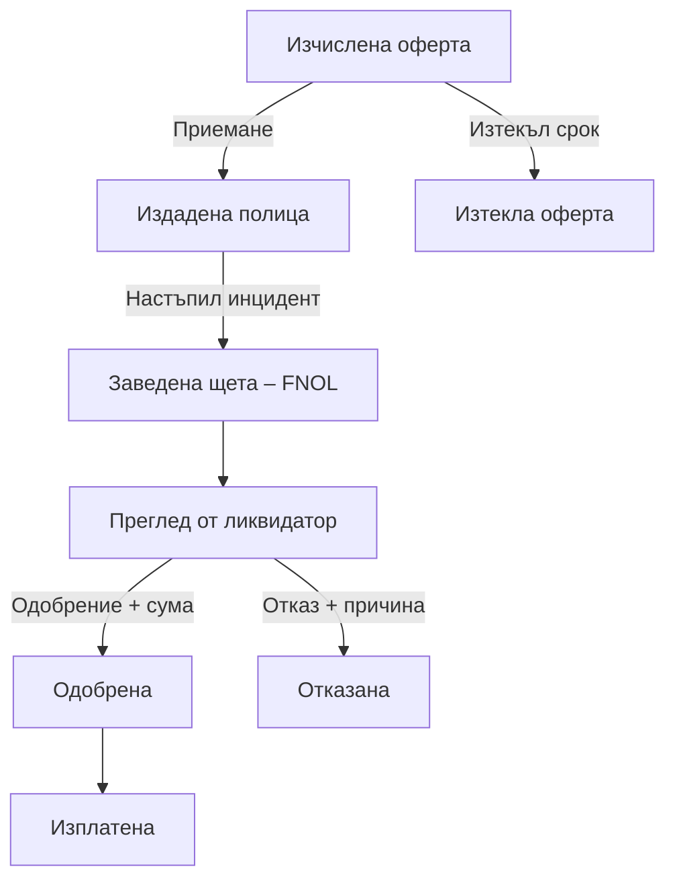

# Motor Insurance — Quote & Claims Portal

## Бизнес анализ, архитектура и план за реализация

---

## Съдържание

1. [Резюме и препоръка](#1-резюме-и-препоръка)
2. [Разяснение на заданието](#2-разяснение-на-заданието)
3. [Бизнес цел и стойност](#3-бизнес-цел-и-стойност)
4. [Потребители и права](#4-потребители-и-права)
5. [Основен бизнес процес](#5-основен-бизнес-процес)
6. [Quote Engine и тарифиране](#6-quote-engine-и-тарифиране)
7. [Оферти и полици](#7-оферти-и-полици)
8. [Завеждане и обработка на щети](#8-завеждане-и-обработка-на-щети)
9. [Известия](#9-известия)
10. [Препоръчана архитектура](#10-препоръчана-архитектура)
11. [Модел на базата данни](#11-модел-на-базата-данни)
12. [Frontend структура и екрани](#12-frontend-структура-и-екрани)
13. [REST API](#13-rest-api)
14. [Съхранение на снимки](#14-съхранение-на-снимки)
15. [Нефункционални изисквания](#15-нефункционални-изисквания)
16. [Стратегия за тестване](#18-стратегия-за-тестване)
17. [MVP и приоритети](#19-mvp-и-приоритети)
18. [Бъдещо развитие](#20-бъдещо-развитие)
19. [Рискове](#21-рискове)

---

## 1. Резюме

- **React + TypeScript** за frontend;
- **Java + Spring Boot** за backend;
- **PostgreSQL** за релационните данни;

- **модулен монолит**, вместо microservices;
- отделно файлово хранилище за снимките;
- версионирани тарифи и snapshots на оферти и полици;
- REST API с ясни бизнес операции;
- in-app известия в първата версия.

Основната цел е да се изгради цялостен процес:

```text
Оферта → Полица → Щета → Преглед → Решение → Изплащане
```

---

## 2. Разяснение на заданието

Системата покрива два важни момента от жизнения цикъл на автомобилната застраховка.

### 2.1. Сключване на застраховка

1. Клиентът въвежда данни за водача и автомобила.
2. Quote Engine изчислява премия.
3. Системата създава оферта с ограничена валидност.
4. Клиентът приема офертата.
5. Създава се полица с уникален номер и период на покритие.

### 2.2. Обработка на щета

1. Клиентът избира полица.
2. Подава първоначално уведомление за щета.
3. Добавя дата, описание и снимки.
4. Ликвидатор разглежда случая.
5. Щетата се одобрява или отказва.
6. При одобрение се записва одобрена и изплатена сума.
7. Клиентът получава известия при промяна на статуса.

### Какво означава FNOL?

**FNOL** означава **First Notification of Loss** — първоначално уведомяване на застрахователя за настъпило събитие. Това не е пълното разследване на щетата, а официалното начало на нейното обработване.

---

## 3. Бизнес цел и стойност

### 3.1. Полза за клиента

- получаване на оферта без посещение на офис;
- прозрачна разбивка на цената;
- онлайн издаване и преглед на полица;
- подаване на щета и снимки;
- проследяване на обработката;
- известия при всяка важна промяна.

### 3.2. Полза за застрахователя

- прилагане на единни тарифни правила;
- по-малко ръчна административна работа;
- история на офертите и решенията;
- проследимост кой служител какво е извършил;
- управление на тарифите без промяна на програмния код;
- по-добро разпределение и наблюдение на щетите.

### 3.3. Възможни показатели за успех

- време за генериране на оферта;
- процент оферти, превърнати в полици;
- средно време за първи преглед на щета;
- средно време за приключване на щета;
- брой щети, чакащи обработка;
- процент успешно доставени известия.

---

## 4. Потребители и права

| Роля | Основни възможности | Ограничения |
|---|---|---|
| **Клиент** | Собствени автомобили, оферти, полици, щети, снимки и известия | Няма достъп до чужди данни и не взема решения по щети |
| **Агент** | Създаване на оферти и полици от името на клиент, обслужване на клиенти | Не одобрява и не отказва щети |
| **Ликвидатор** | Преглед на щети, снимки, документи, одобрение/отказ и определяне на сума | Не управлява тарифи и не променя клиентски данни без основание |
| **Администратор** | Тарифи, версии, потребители, роли и системни настройки | Няма автоматично право да променя решения без audit |

Ролята **агент** не е подробно дефинирана в условието. Екипът трябва да уточни дали агентът:

- работи само със свои клиенти;
- може да издава полица от името на клиент;
- може да редактира тарифи;
- вижда ли щети, или те са само за ликвидатори.

---

## 5. Основен бизнес процес



Всеки преход трябва да се валидира от backend-а. Потребителят не трябва да може да избира произволен статус.

---

## 6. Quote Engine и тарифиране

### 6.1. Входни параметри

Минималният набор включва:

- дата на раждане на водача;
- дата на издаване на свидетелството за управление;
- регион;
- мощност на автомобила;
- bonus-malus клас;
- начална дата на покритието.

Възрастта и шофьорският стаж трябва да се изчисляват от дати. Не е препоръчително клиентът директно да въвежда „25 години“ и „5 години стаж“, защото тези стойности стават неактуални.

В демонстрационната версия данните могат да се подават от клиента. В реална система част от тях биха били потвърждавани чрез официални източници или от застрахователен агент.

### 6.2. Примерна формула

```text
Премия =
базова цена
× коефициент за възраст
× коефициент за стаж
× регионален коефициент
× коефициент за мощност
× bonus-malus коефициент
```

```text
Крайна премия = max(минимална премия, изчислена премия)
```

За всички парични стойности в Java трябва да се използва `BigDecimal`, а в PostgreSQL — подходящ `NUMERIC` тип. Не трябва да се използва `double` за пари.

### 6.3. Разбивка на цената

API трябва да връща както крайната цена, така и използваните коефициенти:

```json
{
  "basePremium": 300.00,
  "ageFactor": 1.30,
  "experienceFactor": 1.15,
  "regionFactor": 1.10,
  "powerFactor": 1.20,
  "bonusMalusFactor": 0.90,
  "totalPremium": 533.61,
  "currency": "EUR",
  "tariffVersion": "2026.1",
  "validUntil": "2026-08-25"
}
```

Стойностите са условен пример, а не реална застрахователна тарифа.

### 6.4. Конфигурируема тарифа

Коефициентите не трябва да бъдат разпръснати в множество `if/else` проверки. Подходящи таблици са:

- `tariff_versions`;
- `age_factors`;
- `experience_factors`;
- `power_factors`;
- `region_factors`;
- `bonus_malus_factors`.

Пример:

| Минимална възраст | Максимална възраст | Коефициент |
|---:|---:|---:|
| 18 | 24 | 1.40 |
| 25 | 35 | 1.15 |
| 36 | 65 | 1.00 |
| 66 | 100 | 1.20 |

Системата трябва да проверява за липсващи и припокриващи се диапазони.

### 6.5. Версии на тарифата

Препоръчителни статуси:

- `DRAFT`;
- `ACTIVE`;
- `RETIRED`.

След активиране тарифата не трябва да се редактира директно. Промяната създава нова версия с нова начална дата. Всяка оферта пази използваната тарифна версия и ценова разбивка.

---

## 7. Оферти и полици

### 7.1. Статуси на офертата

- `CALCULATED`;
- `ACCEPTED`;
- `EXPIRED`;
- `CANCELLED`.

### 7.2. Статуси на полицата

- `SCHEDULED`;
- `ACTIVE`;
- `EXPIRED`;
- `CANCELLED`.

### 7.3. Приемане на оферта

При приемане backend-ът трябва в една транзакция да:

1. провери собствеността на офертата;
2. провери дали офертата не е изтекла;
3. провери дали вече няма издадена полица;
4. маркира офертата като приета;
5. създаде полицата;
6. генерира уникален номер;
7. запази snapshot на клиента, автомобила и тарифата.

Операцията трябва да бъде идемпотентна или защитена с уникални ограничения, за да не се издадат две полици при двойно натискане на бутона.

### 7.4. Уникален номер

Примерен формат:

```text
MI-2026-00001234
```

Не трябва да се използва логика „последният номер + 1“. Уникалността трябва да бъде гарантирана чрез PostgreSQL sequence и `UNIQUE` constraint.

### 7.5. Snapshot на данните

Офертата и полицата трябва да пазят използваните към момента данни. Ако клиентът по-късно редактира автомобила или профила си, старата полица не трябва да се променя.

---

## 8. Завеждане и обработка на щети

### 8.1. Подаване на щета

Клиентът:

1. избира своя полица;
2. въвежда дата на инцидента;
3. въвежда описание и местоположение;
4. качва снимки;
5. изпраща щетата;
6. получава уникален номер.

### 8.2. Основни проверки

- полицата принадлежи на клиента;
- датата на инцидента попада в периода на покритие;
- датата не е в бъдещето;
- описанието има разумна минимална и максимална дължина;
- файловете са от разрешен тип и размер;
- клиентът има достъп само до собствените си щети.

Проверява се дали полицата е покривала инцидента на датата на събитието, а не просто дали е активна при подаване на щетата.

### 8.3. Статуси на щетата

За MVP:

- `SUBMITTED`;
- `UNDER_REVIEW`;
- `APPROVED`;
- `REJECTED`;
- `PAID`.

По желание:

- `NEEDS_MORE_INFORMATION`;
- `WITHDRAWN`.

### 8.4. Правила за преходите

- само `SUBMITTED` може да стане `UNDER_REVIEW`;
- само щета в преглед може да бъде одобрена или отказана;
- отказът изисква причина;
- одобрението изисква положителна одобрена сума;
- само одобрена щета може да стане `PAID`;
- отказаната и изплатената щета са приключени;
- всяка промяна се добавя в `ClaimStatusHistory`.

Вместо общ endpoint за произволна промяна на статус е по-добре да има бизнес операции:

```text
POST /claims/{id}/start-review
POST /claims/{id}/approve
POST /claims/{id}/reject
POST /claims/{id}/mark-paid
```

---

## 9. Известия

За MVP известията могат да бъдат вътрешни:

- щетата е успешно подадена;
- обработката е започнала;
- необходима е допълнителна информация;
- щетата е одобрена;
- щетата е отказана;
- сумата е отбелязана като изплатена.

Известията трябва да се пазят в база данни, а не да бъдат само временни React toast съобщения.

Подходящ дизайн:

1. claim модулът публикува `ClaimStatusChanged`;
2. notification модулът обработва събитието;
3. създава запис в `notifications`;
4. React извлича непрочетените известия.

За първата версия може да се използва Spring application event. Kafka и RabbitMQ не са необходими.

Бъдещи разширения:

- email;
- SMS;
- push notifications;
- Server-Sent Events или WebSocket.

---

## 10. Препоръчана архитектура

### 10.1. Модулен монолит

Подходящото решение е един Spring Boot backend, разделен на ясни бизнес модули.

```text
backend/
└── src/main/java/com/team/motorinsurance/
    ├── auth/
    ├── customer/
    ├── vehicle/
    ├── pricing/
    ├── quote/
    ├── policy/
    ├── claim/
    ├── notification/
    ├── tariff/
    └── shared/
```

Във всеки по-голям модул:

```text
claim/
├── api/
├── application/
├── domain/
└── infrastructure/
```

- `api` — controllers и DTO модели;
- `application` — use cases и application services;
- `domain` — бизнес правила и entities;
- `infrastructure` — JPA repositories, storage и интеграции.

Контролерите трябва да бъдат тънки. Бизнес правилата не трябва да се намират в React компонентите или да бъдат разпръснати в controllers.

### 10.2. Authentication

Най-простото сигурно решение за модулен монолит е Spring Security session с `HttpOnly` и `SameSite` cookie.

Ако проектът изисква JWT:

- да има кратък срок на валидност;
- да не се пази дългосрочно в `localStorage`;
- да се използва защитена cookie стратегия;
- да се предвиди CSRF защита;
- ролите да се валидират на backend ниво.

### 10.3. Monorepo структура

```text
motor-insurance-portal/
├── backend/
├── frontend/
├── docs/
├── docker-compose.yml
├── .env.example
└── README.md
```

Това улеснява локалното стартиране, интеграцията и общата CI конфигурация.

---

## 11. Модел на базата данни

| Entity | Предназначение | Важни данни |
|---|---|---|
| `User` | Вход и роли | email, password hash, role, status |
| `CustomerProfile` | Данни за клиента | имена, дата на раждане, дата на книжката |
| `Vehicle` | Автомобил | VIN, регистрация, марка, модел, мощност, регион |
| `TariffVersion` | Версия на тарифа | version, validFrom, validTo, status, base premium |
| `TariffFactor` | Диапазони и коефициенти | type, min, max, factor |
| `Quote` | Изчислена оферта | total, currency, validUntil, snapshot, breakdown |
| `Policy` | Издадена полица | number, coverageStart, coverageEnd, premium, snapshot |
| `Claim` | Заведена щета | reference, incidentDate, status, adjuster, amounts |
| `ClaimAttachment` | Снимки и файлове | storageKey, MIME type, size, hash |
| `ClaimStatusHistory` | История на щетата | fromStatus, toStatus, actor, reason, timestamp |
| `Notification` | Известия | user, type, entity reference, readAt |
| `AuditLog` | Административна история | actor, action, entity, timestamp |

Core данните трябва да са нормализирани. JSONB може да се използва за immutable snapshots и price breakdown, но не и като заместител на целия релационен модел.

---

## 12. Frontend структура и екрани

### 12.1. Клиентска част

- регистрация и вход;
- dashboard;
- профил на водача;
- моите автомобили;
- wizard за нова оферта;
- резултат и ценова разбивка;
- приемане на офертата;
- моите полици;
- подаване на щета;
- детайли и timeline на щетата;
- известия.

### 12.2. Агентска част

- търсене на клиент;
- оферта от името на клиент;
- издаване и преглед на полици;
- евентуално управление на тарифни настройки.

### 12.3. Ликвидаторска част

- таблица с нови и активни щети;
- филтри по статус, дата и клиент;
- детайли на полицата и инцидента;
- защитен преглед на снимките;
- започване на обработка;
- одобрение или отказ;
- въвеждане на сума;
- история на промените.

### 12.4. Администраторска част

- списък с тарифи;
- редакция на draft версия;
- активиране на версия;
- управление на потребители и роли;
- audit информация.

---

## 13. REST API

### 13.1. Основни групи

```text
/api/v1/auth
/api/v1/profile
/api/v1/vehicles
/api/v1/quotes
/api/v1/policies
/api/v1/claims
/api/v1/notifications
/api/v1/admin/tariffs
```

### 13.2. Примерни операции

```text
POST /quotes
GET  /quotes/{id}
POST /quotes/{id}/accept

GET  /policies
GET  /policies/{id}

POST /claims
POST /claims/{id}/attachments
GET  /claims/{id}
POST /claims/{id}/start-review
POST /claims/{id}/approve
POST /claims/{id}/reject
POST /claims/{id}/mark-paid
```

### 13.3. HTTP статуси

- `400 Bad Request` — невалидни входни данни;
- `401 Unauthorized` — липсва authentication;
- `403 Forbidden` — потребителят няма необходимите права;
- `404 Not Found` — ресурсът не съществува или не е достъпен;
- `409 Conflict` — изтекла оферта, невалиден статус или повторно приемане.

API документацията трябва да бъде достъпна чрез Swagger/OpenAPI.

---

## 14. Съхранение на снимки

Не е препоръчително самите снимки да се пазят директно в PostgreSQL.

### За локалната версия

- файловете се пазят в локална директория или MinIO;
- PostgreSQL пази `storageKey`, тип, размер, hash и дата;
- достъпът до снимката преминава през защитен endpoint.

### Необходими проверки

- генерирано случайно име на файла;
- allowlist за JPEG, PNG и WebP;
- ограничение на размера;
- ограничение на броя снимки;
- проверка на реалния MIME тип;
- проверка на собствеността и ролята при download;
- забрана за изпълними файлове и опасни имена.

В бъдеще storage интерфейсът може да бъде реализиран чрез S3-compatible услуга.

---

## 15. Нефункционални изисквания

### Сигурност

- BCrypt или Argon2 за пароли;
- server-side authorization;
- защита срещу IDOR и достъп до чужди записи;
- validation на всички входни данни;
- rate limiting за login и чувствителни операции;
- защита на файловете и личните данни;
- audit на важните решения.

### Надеждност

- транзакция при приемане на оферта;
- unique constraints;
- optimistic locking при обработка на щети;
- контролирани status transitions;
- database migrations чрез Flyway.

### Поддържаемост

- feature-first структура;
- тънки controllers;
- DTO модели вместо директно излагане на JPA entities;
- централизирана обработка на грешки;
- тестируем Quote Engine;
- ясна документация на бизнес правилата.

### Работа с дати и пари

- `LocalDate` за бизнес дати;
- `Instant` за timestamps;
- съхранение на timestamps в UTC;
- `BigDecimal` за парични стойности;
- изрично правило за rounding;
- изрично ISO поле за валутата.

---

## 16. Стратегия за тестване

### 16.1. Quote Engine

- гранични възрасти;
- гранични стойности на мощността;
- различни bonus-malus класове;
- rounding;
- минимална премия;
- липсващ коефициент;
- припокриващи се диапазони;
- избор на правилната тарифна версия.

### 16.2. Оферти и полици

- изтекла оферта не може да бъде приета;
- една оферта не създава две полици;
- номерът е уникален;
- невалиден период се отхвърля;
- промяна на профила не променя стара полица.

### 16.3. Щети

- инцидент извън покритието се отхвърля;
- бъдеща дата не се позволява;
- клиентът не вижда чужда щета;
- не може директно `SUBMITTED → PAID`;
- отказът изисква причина;
- одобрението изисква сума;
- невалиден файл се отхвърля;
- конкурентни промени се разпознават.

### 16.4. Интеграционни тестове

Testcontainers с истински PostgreSQL е по-надежден от H2, защото позволява да се тестват реалните constraints, SQL типове и миграции.

### 16.5. End-to-end сценарий

1. Клиент влиза в системата.
2. Създава оферта.
3. Приема офертата.
4. Получава полица.
5. Завежда щета.
6. Ликвидаторът я одобрява.
7. Клиентът вижда статуса и известието.

Този сценарий може да бъде автоматизиран с Playwright и използван при демонстрацията.

---

## 17. MVP и приоритети

### Must-have

- регистрация, вход и роли;
- профил на водача и автомобил;
- активна тарифа;
- Quote Engine;
- оферта с валидност;
- приемане и издаване на полица;
- FNOL форма и снимки;
- ликвидаторски workflow;
- история на статусите;
- in-app известия;
- README и инструкции за стартиране.

### Should-have

- административен интерфейс за тарифата;
- филтриране на щети;
- optimistic locking;
- audit log;
- responsive UI;
- подробен price breakdown.

### Stretch goals

- пълно версиониране на тарифите;
- автоматично генерирана PDF полица;
- fraud flags;
- email известия;
- dashboard с показатели.

---

## 18. Бъдещо развитие

### 18.1. PDF полица

PDF документът може да съдържа:

- номер на полицата;
- клиент;
- автомобил;
- период на покритие;
- премия;
- дата на издаване;
- обобщени условия.

Подходящ подход е HTML template, преобразуван чрез OpenHTMLtoPDF.

### 18.2. Basic fraud flags

Системата може да маркира за допълнителна проверка:

- щета скоро след началото на полицата;
- много щети за кратък период;
- повторно използвана снимка със същия hash;
- еднакви описания в различни щети;
- няколко щети за един автомобил за кратък период.

Fraud flag не трябва автоматично да отказва щета. Той само помага на ликвидатора и трябва да показва причината за маркирането.

### 18.3. Допълнителни възможности

- подновяване и прекратяване на полици;
- повече от един водач;
- различни пакети и типове покритие;
- плащане на премия;
- електронен подпис;
- email и SMS;
- автоматично разпределение на щети;
- SLA и dashboards;
- външна проверка на VIN и bonus-malus;
- по-сложен fraud scoring;
- наблюдение, metrics и tracing.

Модулите могат да бъдат отделени като услуги в бъдеще само ако се появи реална нужда от независимо мащабиране или deployment. Не е необходимо проектът да започва като microservices система.

---

## 19. Рискове

- tariff rules са hardcoded в голям service;
- стара оферта се преизчислява по новата тарифа;
- статусите се контролират само от React;
- потребителят може да достъпи чужд ресурс чрез ID;
- използва се `double` за пари;
- снимките са публично достъпни;
- няма история кой е променил щетата;
- при двойно натискане се издават две полици;
- правата на agent и adjuster не са ясно определени;
- прекалено много време се отделя за дизайн преди основният процес да работи;
- stretch функционалностите изместват must-have изискванията;
- липсва общ API договор между frontend и backend.
