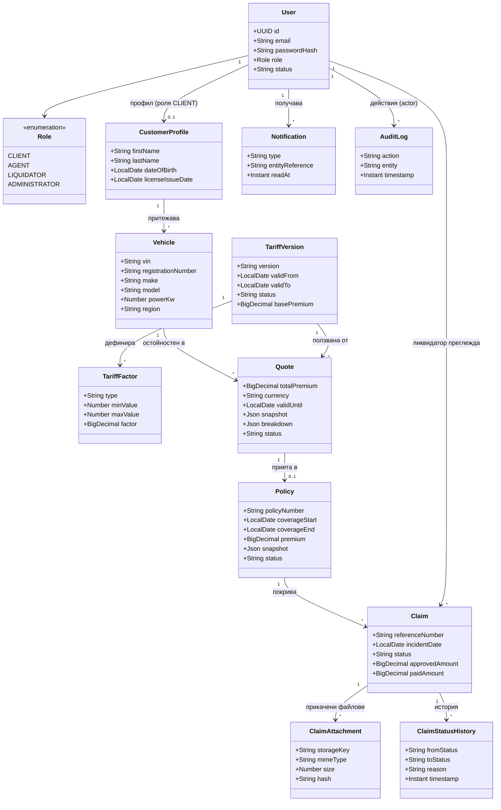
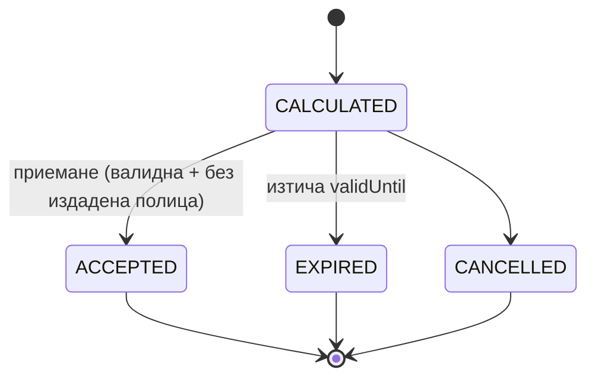
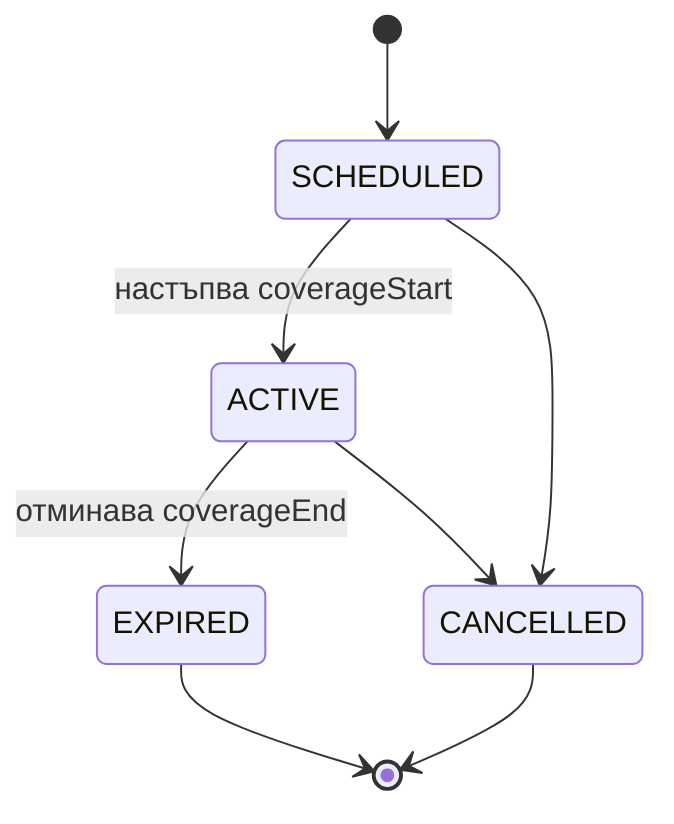
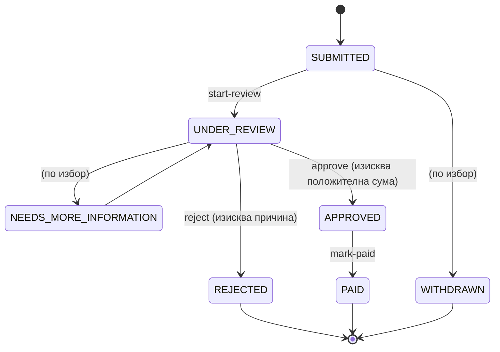
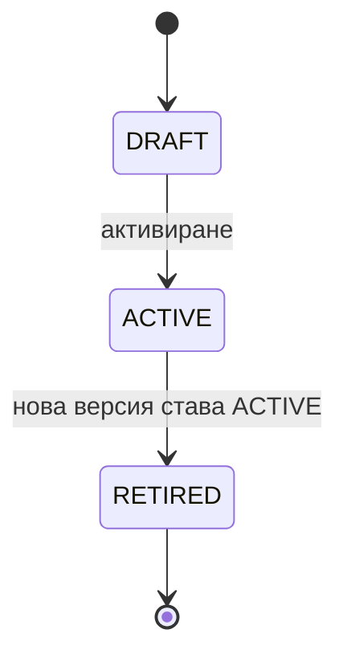
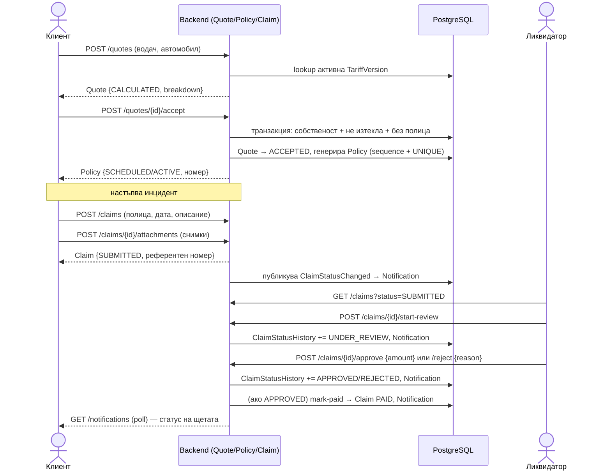
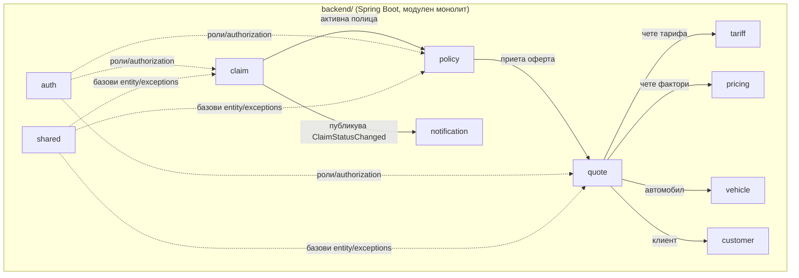

<!-- title: UML диаграми — Motor Insurance Portal -->

# UML диаграми — Motor Insurance Quote & Claims Portal

Изведени изцяло от `Motor-Insurance-Portal-Business-Analysis.md` (раздели 4–11) и `questions.md`. Няма добавени данни от други документи в репото.

---

## 1. Диаграма на класовете (Domain Model)

Източник: раздел 11 (Модел на базата данни) + връзките, описани в разделите за оферти (7), тарифи (6) и щети (8).

---

## 2. Диаграма на use case-овете

Източник: раздел 4 (Потребители и права) + раздел 12 (Frontend структура и екрани).

```mermaid
flowchart LR
    Client(["Клиент"])
    Agent(["Агент"])
    Liquidator(["Ликвидатор"])
    Admin(["Администратор"])

    subgraph UC_Client["Клиентски use cases"]
        direction TB
        uc1(("Регистрация / вход"))
        uc2(("Управление на автомобили"))
        uc3(("Заявка на оферта"))
        uc4(("Приемане на оферта"))
        uc5(("Преглед на полици"))
        uc6(("Завеждане на щета — FNOL"))
        uc7(("Качване на снимки"))
        uc8(("Проследяване на статус на щета"))
        uc9(("Преглед на известия"))
    end

    subgraph UC_Agent["Агентски use cases"]
        direction TB
        uc10(("Оферта от името на клиент"))
        uc11(("Издаване на полица от името на клиент"))
        uc12(("Търсене на клиент"))
    end

    subgraph UC_Liquidator["Ликвидаторски use cases"]
        direction TB
        uc13(("Опашка от щети + филтри"))
        uc14(("Преглед на щета и снимки"))
        uc15(("Одобрение / отказ на щета"))
        uc16(("Въвеждане на изплатена сума"))
    end

    subgraph UC_Admin["Администраторски use cases"]
        direction TB
        uc17(("Управление на тарифни версии"))
        uc18(("Активиране на тарифна версия"))
        uc19(("Управление на потребители и роли"))
        uc20(("Преглед на audit log"))
    end

    Client --- uc1 & uc2 & uc3 & uc4 & uc5 & uc6 & uc7 & uc8 & uc9
    Agent --- uc10 & uc11 & uc12
    Liquidator --- uc13 & uc14 & uc15 & uc16
    Admin --- uc17 & uc18 & uc19 & uc20
```

> Раздел 4 отбелязва изрично: ролята **агент не е напълно дефинирана** в заданието — обхватът на use case-овете `uc10`–`uc12` е за уточняване на екипната среща (виж и `questions.md`, т. 9 за процеса на работа).

---

## 3. Диаграми на състоянията

### 3.1 Оферта (Quote) — раздел 7.1

### 3.2 Полица (Policy) — раздел 7.2

### 3.3 Щета (Claim) — раздели 8.3 и 8.4

> Директен преход `SUBMITTED → PAID` е забранен по дизайн (раздел 8.4 и раздел 16.3 — тестова стратегия изрично проверява това).

### 3.4 Тарифна версия (TariffVersion) — раздел 6.5

> След `ACTIVE` версията не се редактира директно — промяна винаги създава нова `DRAFT` версия (раздел 6.5).

---

## 4. Диаграма на последователността — цялостен бизнес процес

Източник: раздел 2 (Разяснение на заданието), раздел 5 (Основен бизнес процес), раздел 7.3 (Приемане на оферта) и раздел 9 (Известия).

---

## 5. Диаграма на пакетите — модулен монолит

Източник: раздел 10.1 (Препоръчана архитектура).

> Плътните стрелки = директна бизнес зависимост; пунктираните = напречни (cross-cutting) зависимости от `auth`/`shared`, ползвани от всеки модул.
