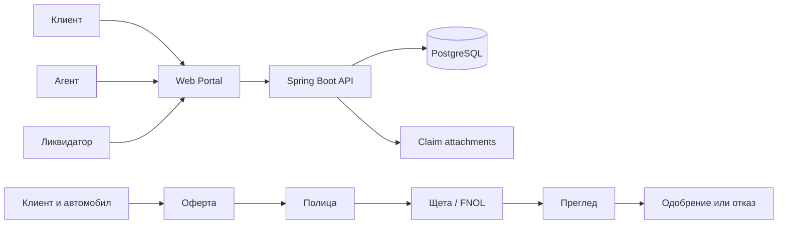
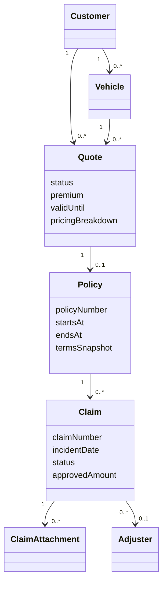

# Начални UML/домейн диаграми

Диаграмите са работна хипотеза за обсъждане с ментора.

## Контекст и основен поток

## Предложени домейн връзки

Имената, cardinality и lifecycle правилата трябва да се потвърдят преди
създаване на production entities.
